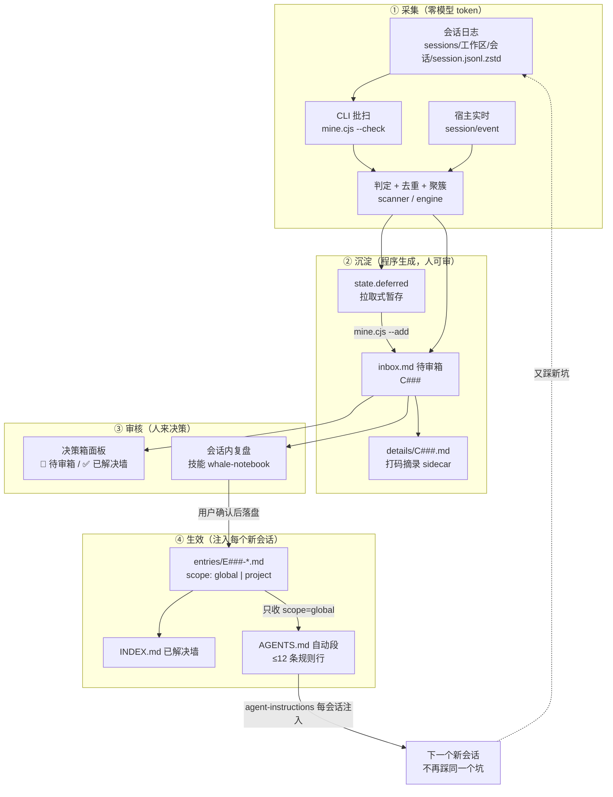
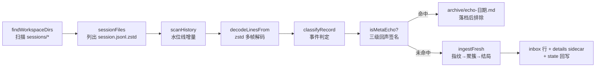

# 鲸鱼闪闪发光的小本本（whale-notebook）· 架构全景图

> 日期：2026-09-11（复核）｜ 版本：**v0.7.3（版本口径已全量对齐）**｜ 作者：DSH AI 会话 ｜ 类型：架构全景（现状快照）
> 定位：本文是**一张可通读的全景图**——把散落在 `plugin/README.md`、`PROJECT-INTRO.md`、`src/ui/contracts.md` 与 9 份设计文档里的架构事实收到一张图上，并补上**实测的现状**（§9）与**缺口清单**（§11）。
> 不替代既有文档：版本沿革看 `CHANGELOG.md`，设计论证看 `docs/` 九份设计记录，操作流程看技能 `whale-notebook`。
> **本轮复核（2026-09-11）**：§9 现状表已按现场重测；§11 缺口清单逐条标注「已修/未修」，并新增**安全与健壮性审计**一节（详见 `docs/2026_09_11_11_whale-notebook安全与健壮性审计报告.md`）。

---

## 0. 怎么用这张图（3 分钟路线）

| 你想知道 | 直接跳 |
|---|---|
| 这东西到底怎么跑起来的（闭环） | §2 全景总图 |
| 「插件」在 DSH 里挂在哪一层 | §3 三平面：现在真正落地了什么 |
| 源码分成哪几块、谁能依赖谁 | §4 六模块分层 |
| 我的会话日志是怎么变成候选的 | §5 采集流水线 |
| GUI 右缘那个鲸鱼面板怎么接的 | §6 双半桥接 |
| 装/卸/升级动的是哪些文件 | §7 生命周期与部署 |
| 能不能手改数据文件 | §8 数据契约与不变式 |
| 现在到底什么状态 | §9 现状实况（实测） |
| 有什么坑还没填 | §11 缺口与风险 |

---

## 1. 一句话定位与四个支柱

**一句话**：把本机 DSH 全部工作区会话里反复出现的问题，自动挖掘 → 提炼为候选 → **经用户逐条确认**写成经验条目 → 以规则行注入 `~/.dsh/AGENTS.md` 自动段 → 每个新会话开始就被注入，从而"**从这次踩坑到永不重犯**"。

| 支柱 | 落地形态 |
|---|---|
| 数据源 | 只读本机会话日志 `~/.dsh/sessions/*/*/session.jsonl.zstd`（多帧 zstd + JSONL） |
| 沉淀形态 | `inbox.md` 待审候选 → `entries/E###-*.md` 条目 → AGENTS 自动段规则行 |
| 人机关系 | **先展示后写入**：候选/规则/条目一律先给用户看，确认才落盘；AI 从不静默改记忆 |
| 隐私 | 只读日志、不复制原文、入箱前打码（密钥 → `[REDACTED]`）、指纹只存 FNV-1a 短哈希、数据永不离开本机 |

---

## 2. 全景总图（闭环）



> 读图要点：**采集是程序（0 token）、审核是人、生效是注入**。三条入口（CLI 批扫 / 宿主实时 / 面板 ⟳）汇入**同一套判定与入库路径**，规则不会漂移。

---

## 3. 三层记忆与三平面：现在真正落地了什么

### 3.1 三层记忆（数据的三个高度）

| 层 | 位置 | 内容 | 谁维护 |
|---|---|---|---|
| **L1 全局记忆** | `~/.dsh/AGENTS.md` 自动段 | ≤12 条高频**全局**规则行 + 固定尾注 | 生成器 `src/inject/agents.cjs`，落盘由 agent 用 `edit` 工具 |
| **L2 技能（操作手册）** | `~/.dsh/skills/whale-notebook.md` | 复盘/审核/入库/讨论/忘掉/统计/体检 的流程 | 技能体系热加载，由生命周期安装器管理 |
| **数据** | `~/.dsh/whale-notebook/` | 待审箱、条目、已解决墙、归档、状态、设置 | `src/store/repo.cjs`（唯一读写入口） |

### 3.2 三平面（DSH 扩展体系里的落位）

```text
┌──────────────────────────── DSH 运行时 ────────────────────────────┐
│                                                                    │
│  【主机平面 / host composition】        ← 现在：已真实挂载           │
│   profiles/web/cordis.patch.yml 标记区内（block 序列）：        │
│     - insert:                                                      │
│         - id: whale-notebook                                       │
│           name: '@deepseek-ai/dsh-whale-notebook'                  │
│           inject: [webServer]    ← 等 webServer 服务出现再挂载        │
│   提供：/whale/* HTTP 端点 + 订阅 session/event 常驻实时采集          │
│                                                                    │
│  【会话平面 / agent preset】          ← 现在：走官方注入机制，非插件行 │
│   AGENTS.md 自动段（agent-instructions 每会话注入）                   │
│   + 技能 whale-notebook                                             │
│   （设计文档预留的 preset 工具行 / 硬拦守卫 尚未启用）                 │
│                                                                    │
│  【UI 平面 / client bundle】          ← 现在：已真实挂载              │
│   package.json dsh.client = { platform: 'web',                      │
│     inject: ['@deepseek-ai/dsh-client-runtime'] }                   │
│   exports["./client"] → lib/client.js                               │
│   DSH client-loader 每请求现读磁盘 → 面板悬浮件（纯 DOM 注入）        │
└────────────────────────────────────────────────────────────────────┘
```

**关键认识**：「插件」在这里不是一个东西，而是**三处挂载点**——主机平面一行（端点 + 实时采集）、会话平面一段注入文本（规则行）、UI 平面一个 bundle（面板）。三者共享同一份 `src/` 逻辑与数据契约，可以各自独立演进。

**生效代价不同**（架构上很重要）：

| 改动什么 | 生效方式 |
|---|---|
| `lib/client.js`（面板） | **刷新页面**即可（loader 每请求现读磁盘 + no-cache） |
| `lib/index.js`、`src/**`（宿主半边） | **必须重启 `dsh web`**（会中断在线会话，时机由用户定） |
| `mine.cjs` 批扫 | 不依赖重启，立即可用 |

---

## 4. 六模块分层（`plugin/src/`，单向依赖）

```text
                    ┌──────────────────────────────────────────┐
   装配（无逻辑）    │  lib/index.js  ← apply(ctx)：注册端点/事件  │
                    └───────────────┬──────────────────────────┘
                                    │
      ┌──────────────┬──────────────┼───────────────┬──────────────┐
      ▼              ▼              ▼               ▼              ▼
 ┌─────────┐   ┌──────────┐   ┌───────────┐   ┌──────────┐   ┌──────────┐
 │  ui/    │   │ review/  │   │ collector/│   │ inject/  │   │ lifecycle│
 │ 展示层   │   │ 审核层    │   │ 记录层     │   │ 生效层    │   │ 自举安装  │
 │ viewmodel│  │ commit   │   │ decoder   │   │ agents   │   │ (仅 node │
 │ server   │   │ planCommit│  │ patterns  │   │ 自动段生成 │   │  内建)   │
 │ contracts│   │ (纯函数)  │   │ scanner   │   │          │   │ 与业务   │
 │ lib/client│  │          │   │ engine    │   │          │   │  解耦)   │
 │ .js      │   │          │   │ live      │   │          │   │          │
 └────┬─────┘   └────┬─────┘   │ cli       │   └────┬─────┘   └──────────┘
      │              │         └─────┬─────┘        │
      │              │               │              │
      ▼              ▼               ▼              ▼
 ┌───────────────────────────────────────────────────────────────┐
 │                      store/repo.cjs  数据层                    │
 │   路径常量 · 原子写 · settings/state/inbox/entries/details     │
 │   · INDEX 已解决墙生成器（唯一读写入口）                        │
 └───────────────────────────┬───────────────────────────────────┘
                             ▼
 ┌───────────────────────────────────────────────────────────────┐
 │                        core/  领域层（零依赖）                  │
 │  schema（类别/协议/模板） · privacy（打码/指纹，唯一出口）       │
 │  summarize（现象一句话） · similarity（骨架+3-gram 族判定）      │
 │  util                                                          │
 └───────────────────────────────────────────────────────────────┘
```

**依赖规则（禁止反向）**：`ui → viewmodel → store`，且 `viewmodel → core/schema`、`ui/server → core/similarity`；`review → (schema, inject, store)`；`inject → (schema, store)`；`collector → (core, store)` 且 `collector/cli → inject/agents`；`store → core/schema`；`core` 零依赖。`lifecycle/` 与业务完全解耦，只依赖 node 内建。
（2026-09-11 复核补全：原表漏了 `inject → store`、`collector/cli → inject`、`viewmodel → core/schema`、`ui/server → core/similarity` 四条边；**「禁止反向」本身成立**——`store` 不 import `ui`，`core` 无任何项目内依赖。）

| 层 | 一句话职责 | 关键导出 |
|---|---|---|
| `core/` | 全项目共用契约：类别表、打码、指纹、现象压缩、相似度 | `CATEGORY_TITLES`、`redact/hash36/canonText`、`oneLiner`、`similarity/bestFamily` |
| `store/` | 单一事实源：所有文件读写的唯一入口，原子替换 | `P`（路径常量）、`listEntries`、`readEntryText`、`buildIndexMd`、`writeDetail` |
| `collector/` | 会话日志 → 事件 → 候选；批扫与实时共用判定层 | `runScan`、`ingestFresh`、`createLiveCollector`、`classifyRecord` |
| `inject/` | 条目 → AGENTS 自动段正文（只收 `scope=global`） | `buildSectionBody`、`applyToText` |
| `review/` | 计划式入库纯函数：**只出计划，不写磁盘** | `planCommit`、`pickInboxRows` |
| `ui/` | 视图模型 + host 端点纯逻辑 + 面板 bundle | `listPayload`、`solvedPayload`、`relatedPayload`、`deleteCandidate` |

> **「纯函数出计划 + agent 工具落盘」是本项目反复出现的模式**：`review/commit.cjs` 与 `inject/agents.cjs` 都不写盘，由 agent 用 `write/edit` 执行——这样 `agent-instructions` 才能观测到 AGENTS.md 变更并**即时注入当前会话**。

---

## 5. 采集流水线（采集层）

### 5.1 端到端（函数级）



**水位线（增量）**：`state.files[日志绝对路径] = {size, mtimeMs, offset, frames, sid, ws, calls}`。

- 文件 `size+mtimeMs` 未变 → **只 stat 跳过**（热启动约 10ms、读 0 字节）；
- 变大 → 只解 `[offset, EOF)` 的新帧，**帧边界与行边界对齐**；末尾半写帧不推进 offset（下次自动重试）；
- 水位线失效（截断/轮转/非法帧头）→ 该文件退回全量重扫。

### 5.2 事件判定（什么算"坑"）

| 来源 | 判据 |
|---|---|
| 工具失败 | `tool/result` 的 `isError` → `cat='error'`（引擎内建类别） |
| 工具输出特征 | 命令类工具（`pwsh/bash/node`）成功输出命中特征词典（`patterns.cjs`） |
| 用户报障叙述 | `user/message` 命中 `NARRATION_IDS` + 强特征（限 12<n≤400 字，排除注入框架文本） |

**特征词典（9 类正则 + 引擎内建 `error` = 10 个采集类别）**：`patterns.cjs` 的 `PATTERNS` 共 **9** 条——`encoding`（编码乱码）、`sandbox-ep`（EPERM/ConstrainedLanguage/管道）、`sandbox-file`（沙箱拒绝写/审批）、`stale-fs`（read-before-edit）、`timeout`、`git-net`、`model-api`（限额/429）、`file-missing`、`port-busy`；第 10 个采集类别 `error` 由引擎内建（任何 `isError` 的工具结果直接判 `error`）。
`core/schema.cjs` 另备 **17 个条目展示类标题**（9 个采集类别 + `error` + approval/tool-mode/secret/session-state/data-access/long-session/other）。
**只有 4 类接受用户叙述**（`NARRATION_IDS = encoding / sandbox-ep / sandbox-file / git-net`）——避免把用户的普通描述误判成坑。

**回声过滤（防止"小本本采集自己"）**：三级签名——`META_STRONG`、`META_DUMP` 单条即判；`META_WEAK` 需 ≥2 条。过滤对象是**自引用、探针输出、以及"把历史日志/sidecar/state 转储出来"的回显**（信封 `==== L### <kind>`、会话记录 JSON 信封、notebook 表行）。命中者**不静默丢弃**，落 `archive/echo-<日期>.md` 可事后审计。

### 5.3 去重、聚簇、同族、复发（状态机）

```text
   新事件 ──指纹重复？──▶ [丢弃]（seenFingerprints，上限 5000）
      │否
      ▼
   聚簇哈希 cat|tool|canonText(text)
      ├─ 命中在箱聚簇 ──────▶ bump    ：只累加次数（不开新行）
      ├─ 命中已处置签名 ────▶ resolved：压掉（归档表为事实源）
      │        └─ 冷却期（7 天）内 ─▶ silent：静默计数
      ├─ 与某「族」相似 ────▶ family  ：并入族代表行 + sidecar 记「同族并入」
      ├─ 曾处置且超冷却期 ──▶ readd   ：复发重开，行前缀「复发（原 C0xx）：」
      └─ 都不是 ───────────▶ new     ：新候选行（C###）
```

- **族（family）**：同一 `cid` 的多个聚簇天然构成一族；未命中同文聚簇但与族相似 → 并入族代表行（面板显示「**族×N**」），不新开行。
- **相似度算法**：`skeleton()` 剥掉易变部分（sid/uuid/IPv4/时间戳/带单位数值/路径/端口/长数字）→ 字符 **3-gram** 集合 → 得分 `max(Jaccard, containment×0.9)`；阈值**同类 0.6 / 跨类 0.8**（`settings.familyThresholdSame/Cross` 可调）；骨架短于 12 字符只认完全相等。
- **"同类"怎么算**：类别先归组（`CAT_ALIAS`：`git-net`/`timeout`/`model-api` → net，`sandbox-*` → sandbox，`error` 作通配兜底），同组才用宽松阈值。
- **设计意图**：把"还有没有类似问题"从**模型即兴归纳**变成**程序算得出、可复现、可解释**。程序只保证"该看哪些"，同根因与否由人/agent 给结论。

### 5.4 拉取式（当前模式）

`settings.autoAdd = false`（本机现状）时：

```text
扫描照常（增量、0 token） → 新发现只写 state.deferred（上限 200，按最近保留）
                          → 用户说「小本本复盘」→ mine.cjs --add 一次性冲入 inbox
已在箱候选命中共聚簇 → 仍然只累加次数（不受拉取式影响）
```

CLI 命令面（`scripts/mine.cjs` 是转发薄壳）：

| 命令 | 做什么 | 写盘 |
|---|---|---|
| `--check` | 增量扫描（默认模式） | state（+入箱时 inbox/details/echo） |
| `--add` | 不重扫，把 `deferred` 冲入待审箱 | inbox + details + state |
| `--check --add` | 扫完直接入箱（`--rebuild --add` 同） | 同上 |
| `--rebuild` | 清空水位线/聚簇/暂存/指纹，从头梳理全部历史 | state |
| `--full` | 忽略水位线全量重扫（仍按指纹去重） | state |
| `--dry` | 只看不写 | 否 |
| `--stats` | 统计（纯只读） | 否 |
| `--prewarm` | 只记指纹与水位线，不入箱 | state |
| `--render-rules` | 预览 AGENTS 自动段正文 | 否 |
| `--wall` | 预览已解决墙（INDEX.md）全文 | 否 |

> **口径**：flag 共 **9 个**（5 个 MODE + `--render-rules` / `--wall` / `--full` / `--dry`）；表内 `--check --add`、`--rebuild --add` 属**组合用法**，不是独立参数。

---

## 6. 双半桥接：决策箱面板

### 6.1 通信拓扑

```text
        浏览器（GUI 页面）                         Node（dsh web 进程）
 ┌──────────────────────────────┐          ┌────────────────────────────────┐
 │ lib/client.js                │          │ lib/index.js  apply(ctx)        │
 │  __ModuleLoader__ bundle     │          │  ① 订阅 session/event → live     │
 │  exports.apply(ctx)          │  HTTP    │  ② webServer.register(8 个端点)  │
 │  ├ 纯 DOM 注入 body/head     │ ───────▶ │     业务纯逻辑在 src/ui/server.cjs│
 │  ├ 30s 轮询 + focus/可见性   │ ◀─────── │                                │
 │  ├ ctx.sessions/workspaces   │  JSON    │ 数据读写全部经 src/store/repo.cjs│
 │  └ ctx.effect(可逆清理)      │          │                                │
 └──────────────────────────────┘          └────────────────────────────────┘
```

- **不是 Slot 注册**：面板是"外挂式"——把 `<style>` 插进 `document.head`、面板节点插进 `document.body`，靠 `position:fixed; z-index:2147482000` 悬浮在 GUI 右缘；样式用 `var(--dsw-alias-*)` 主题 token 并带回落色值。
- **可逆**：`ctx.effect` 注册的清理函数在卸载时 `clearInterval`、摘掉 4 个全局监听、移除面板/toast/警示条节点。
- **面板不写记忆（契约红线）**：8 个端点里只有 2 个是写操作（删除候选 → 归档、触发增量扫描），**没有任何"审核/入库/忘掉"端点**——那些必须回落成"带编号回写会话 → 展示 → 用户确认 → agent 用工具落盘"，面板无权直接改 `entries/` 与 `AGENTS.md`。💬 讨论走的是客户端 `sessions`/`workspaces` 服务（非 HTTP）：`sessions.create({workspaceId})` → 等绑定 → 投递开局消息 → `sessions.open(id)`。
- **宿主侧的依赖姿态是"软依赖 + 优雅降级"**：加载器行声明了 `inject: [webServer]`（等 `webServer` 服务出现再挂载），而 `lib/index.js` 内部仍用 `ctx.get('webServer')` 取服务，取不到就 warn 并 return——**实时采集照常工作，只是面板 API 不注册**，不会因为缺一个服务把整个插件挂死。
- **轮询**：30s 一次（`document.hidden` 时跳过）+ `focus` / `visibilitychange` 立即刷新；风险观察另有一个独立 interval（`[WHALE-RISK]` 检测）。

### 6.2 端点契约（host half，共 8 个）

| 方法 | 路径 | 返回/入参要点 |
|---|---|---|
| GET | `/whale/inbox` | `{pending, rows[{id,cat,n,ws,text,time,variants}], deferred}` — `variants` = 族×N |
| GET | `/whale/inbox/detail?id=C###` | 候选详情 sidecar 文本（`details/C###.md`） |
| GET | `/whale/solved` | 已解决墙：`{ok, stats{active,global,project,disabled}, global[{cat,title,entries[]}], projects[{ws,entries[]}], disabled[]}` |
| GET | `/whale/entry?id=E###` | 条目全文（frontmatter + 正文） |
| GET | `/whale/live` | 运行状态：`{version, live{...}, watermarks, clusters, fingerprints, lastScan}` |
| GET | `/whale/related?id=C###` | 讨论的**确定性依据**三块：`family`（族成员）+ `related`（相似候选，阈值 0.35）+ `entries`（可能已被条目覆盖：得分 = `max(相似度, 同类别则 0.3)`，再按 ≥0.25 过滤 → 同类别条目有 0.3 的隐性下限） |
| POST | `/whale/inbox/delete` | body `{id:"C###"}` → 移入 `archive/`（**可恢复**，detail 随行归档）；带重入语义幂等 |
| POST | `/whale/scan` | 面板 ⟳：先 `live.flush()` 落盘缓冲，再 `runScan('--check')`；扫描中再次请求返回 **409** |

> **安全边界（2026-09-11 实测）**：端点**无鉴权、无 Origin/Referer 校验**，但 `dsh web` 只监听 `127.0.0.1:3080`，不对局域网暴露。残留风险 = **跨站请求伪造**（网页可盲发 POST 造成删除候选/触发扫描的副作用，读不到响应体）与**DNS rebinding**（无 Host 校验时的理论读取通道）；另一注意点是 `/whale/scan` 在宿主事件循环内**同步**执行，全量路径耗时 5s 级（详见 §11.2 N1/N4 与审计报告）。

### 6.3 面板交互面

| 元素 | 行为 |
|---|---|
| 🐳 待审箱卡 | 候选行（现象 = 规则精炼一句话 ≤90 字）；行 hover 出动作；页头 ✅ 直达已解决墙 |
| ✅ 已解决墙卡 | 全局区（按类别分组）/ 项目区（按适用项目）/ 停用收尾；点行拉 `/whale/entry` 展开全文；页头 🐳 回待审箱 |
| ⟳ | 先触发增量扫描（零 token），再刷新；tooltip 报「新发现 N 条 / 无新发现 + 耗时」 |
| ✕（红色） | 删除候选 → 移入 `archive/`（可恢复） |
| 💬 详细讨论 | 取 `/whale/related` 三块证据 → **开新会话**并写入开局消息；落点由**讨论落点路由**决定：候选工作区列**为空/未知 → 判 global**（保守放全局），**同名歧义或侧栏未注册 → 回退当前工作区**并在 toast 说明，单项目 → 开在该项目工作区，跨项目 → 开在固定的「鲸鱼全局」工作区；页脚三态开关（自动/🐳 全局/📁 项目）记 `localStorage` 键 `whale.discussRoute`，落点与依据写进开局消息 |
| ⚡ 自动处理 | **已暂时隐藏**（`AUTO_VISIBLE=false`，代码与判定表保留）；恢复后仅允许"补全型小修"，禁区一律拒绝 |
| `[WHALE-RISK]` | agent 回复固定行 → 面板弹红色警示条 + 「转人工讨论」 |
| 页脚三态开关 | 「自动｜🐳 全局｜📁 项目」= 讨论落点手动覆盖，选择记 `localStorage` |
| 自隐逻辑 | 🐳 卡仅当 `pending>0 或 deferred>0` 才出；✅ 卡仅当 `active>0` 才出；两者皆无 → **整面板 `display:none`**（不打扰） |
| 反馈节奏 | toast 2800ms 淡出；`[WHALE-RISK]` 观察窗 = 每 4s 轮询会话快照、最多 45 次（≈180s），正则 `/^\s*\[WHALE-RISK\]/` **无 `m` 标志** → 实际只锚定「整段文本开头」（首行/首部），不是任意行首 |

---

## 7. 生命周期与部署

### 7.1 三段足迹（"痕迹必须可指认"）

| 段 | 内容 | 归属 |
|---|---|---|
| **R 运行时** | `profiles/web/node_modules/@deepseek-ai/dsh-whale-notebook`（部署副本）+ `profiles/web/cordis.patch.yml` 标记区内的加载器行 | 生命周期只登记/对账/快照/驱动；**写入与删除一律交 `deploy-web.cjs`** |
| **I 集成** | `AGENTS.md` 标记区（+ `whole` 模式下整文件）+ 技能文件 | 生命周期安装器 |
| **D 数据** | `~/.dsh/whale-notebook/`（**用户记忆，永不静默删**） | 用户 |

**三个 zone（跨两个文件）**：

```text
~/.dsh/AGENTS.md
  <!-- whale-notebook:rules -->      … <!-- /whale-notebook:rules -->      ← 规则自动段
  <!-- whale-notebook:privacy -->    …（隐私尾注区）
~/.dsh/profiles/web/cordis.patch.yml
  # --- whale-notebook 决策箱面板 (deploy-web.cjs managed) ---
       - insert:
           - id: whale-notebook
             name: '@deepseek-ai/dsh-whale-notebook'
             inject: [webServer]
  # --- /whale-notebook panel ---
```

生命周期清单（`.lifecycle/manifest.json`）只**按标记区**对账 R 段，**绝不整文件 hash 判漂移**（该文件可能同时含别的插件的行）。

### 7.2 命令面（两段式：干跑出计划 → 确认 → `--apply`）

| 命令 | 作用 |
|---|---|
| `lifecycle/cli.cjs status` | 阶段 / 各段足迹 / 上次操作（含 R 段现场对账） |
| `… check` | 清单 vs 现场对账 + 孤儿扫描（I/D 有问题 exit 1；**R 段是信息级**，不左右退出码） |
| `… install [--apply]` | 登记/安装（`--agents-mode whole\|zones`）；顺带完成清单版本迁移 |
| `… uninstall detach` | 仅摘 R 段（驱动 `deploy-web --undo`） |
| `… uninstall remove` | 清 R+I，**D 原样保留** |
| `… uninstall purge` | 全清：必须 `--export-dir` + `--yes`（先导出后删除） |
| `scripts/deploy-web.cjs [--apply\|--check\|--undo]` | **R 段唯一写入者**：物理复制包 + 在标记区内插/摘加载器行 |

**安全闸**：凡改写/删除外部目标先做**字节级前像快照** `.lifecycle/backups/<时间戳>/<id>.bak`（remove 后重装可**字节等价还原**）；登记后文件被外部改动 → remove 中止并提示 `--yes`（漂移守卫）；`purge` 前置导出 + 二次确认。

> **注意**：`deploy-web.cjs` **不往 DSH 产物里注入 JS**。浏览器半边靠 `package.json` 的 `exports["./client"]` + `dsh.client.platform="web"` 由 DSH 自身 client-loader 收录；本工具只做"复制包 + 插一行加载器"。

### 7.3 维护工具

`scripts/links-doctor.cjs`：体检/清理**工具主目录里的悬空 junction/symlink（死链）**。判据必须"跟随式"——`lstat` 看是不是链接、`statSync` 看目标在不在（`Test-Path` 对悬空 junction 会误报存在）。默认**只读**（**exit 3 = 发现悬空**）；`--apply` 逐条复验后**只摘链接本身**（实体目录/有效链接/根外路径一律不碰）。动机：死链会让 ripgrep 报 exit 2、**整次检索结果被丢弃**（条目 E005）。

---

## 8. 数据契约与不变式（改数据前必读）

| 对象 | 形态 |
|---|---|
| 待审行 | `\| C### \| 类别 \| 次数 \| 工作区 \| 现象(打码,≤120字) \| 首次出现 \|`（列内 `\|` 必须转全角 `｜`，否则该行无法被表格解析） |
| 候选详情 | `details/C###.md`：一句话 / 类别次数 / 源会话引用 ≤3 / **打码摘录 ≤600 字**；候选行移出时随行归档到 `archive/details/` |
| 条目 | `entries/E###-slug.md`：frontmatter（`id/title/category/status/scope/projects/occurrences/firstSeen/lastSeen/workspaces/rule/created/updated/sources`）+ `## 现象 / ## 根因 / ## 对策 / ## 验证` |
| 规则行 | `- 【类别】对策一句话`，进 AGENTS 自动段按 `occurrences` 降序取前 `maxRulesInAgents`(12) 条 |
| AGENTS 自动段 | 整段由生成器维护（**勿手改**），含状态行 + 规则行 + 3 行固定尾注（采集提醒/触发词/隐私） |
| 已解决墙 | `INDEX.md` = 全局区（`scope=global` 按类别）+ 项目区（`scope=project` 按项目）+ 停用收尾；生成器 `repo.buildIndexMd`，与面板 ✅ 卡**同源** |

**`state.json` 结构**（派生状态，可重建）：

```text
{ v:2, lastScan, nextCandidateId,
  seenFingerprints[],                 // 事件级指纹（FNV-1a 短哈希），上限 5000
  files{ <日志路径>: {size,mtimeMs,offset,frames,sid,ws,calls} },   // 水位线
  clusters{ <簇哈希>: {cid,cat,text,n,first,last,reAddedAt,reAdds,family,…} },
  deferred{ <簇哈希>: {cat,text,n,first,last,ws[],refs[],excerpt,at} } }
```

> **去重的事实源不是 `state.json` 而是归档表**（`archive/archive-*.md`，末列非空 = 已处置）。state 可被 `--rebuild` 清空，故"是否已处置"必须问归档——这条修掉了"重置/重扫后同一个坑重复开行"。

**`settings.json` 开关**：12 个默认开关 —— `autoCollect` / `autoAdd`（拉取式） / `liveCapture`（实时采集） / `scanMode` / `checkEnabled` / `denylistWorkspaces` / `minOccurrences` / `maxRulesInAgents` / `reminderListMax` / `maxDeferred` / `maxFingerprints` / `reAddCooldownDays`；另加 **2 个可选覆盖键** `familyThresholdSame|Cross`（**未登记进 `SETTINGS_DEFAULTS`**，`engine.familyThresholds()` 有值就用、缺省走 `similarity.cjs` 的 0.6/0.8，见 §11.2 N9）。

**隐私出口唯一**：`core/privacy.cjs` 的 `redact`（压白，指纹不变式依赖）/ `redactLines`（保留行结构）/ `hash36` / `canonText`。打码发生在**事件聚合之前**，所以 inbox / details / echo / 面板消费的全是已打码文本。

---

## 9. 现状实况（2026-09-11 11:0x 复核实测）

> 复核方式：全部为**只读探针**（GET 端点、`--check`、`--stats`、`deploy-web --check`、`lifecycle check`、只读测试套件）＋ 数据目录直接比对；未写任何数据、未重启宿主。

### 9.1 挂载与运行

| 项 | 实测值 |
|---|---|
| 插件包版本 | **0.7.3**（`package.json`、`lib/index.js` 的 `PACKAGE.version`、两份 README、`PROJECT-INTRO.md`、`CHANGELOG.md` 六处口径一致 ✅ 已修） |
| 主机平面 | 已挂载：`profiles/web/cordis.patch.yml` 标记区内 `insert: whale-notebook (inject: [webServer])` |
| 运行进程 | `dsh web` 进程启动于 2026-09-11 10:47；`GET /whale/live` → `version: 0.7.3`、`live.enabled: true`、`lastError: null` |
| 实时采集计数 | **进程内累计量，随运行持续增长、非稳定指标**：冷启动时 sessions 4 · events 1 · flushes 1 · deferredGroups 1；复核过程中（≈11:10）已变为 sessions 6 · events 13 · flushes 13 · echoGroups 7 · deferredGroups 6 · lastError null |
| 状态规模 | `watermarks` 30 份会话日志 · `clusters` 59 · `fingerprints` 194→199（随会话实时增长） |
| 端点可用性 | 6 个 GET 全 **200**（`inbox` / `inbox/detail` / `solved` / `entry` / `live` / `related`）；`POST /whale/scan` → 200，增量扫描 **83–100ms** |
| 监听范围 | **仅 `127.0.0.1:3080`**（`Get-NetTCPConnection` 实测；LAN 地址均不可达）——端点无鉴权，但不对局域网暴露 |

### 9.2 数据面

| 项 | 实测值 |
|---|---|
| 待审箱 | **2 条**：C128（git-net）、C129（error，`复发（原 C098）：`） |
| 已解决墙 | active **5**（全局 4 + 项目级 1），停用 0；全局区类别顺序 编码 → tool-mode → git-net（`sortCategoryKeys` 契约在宿主生效） |
| 暂存（未入箱） | 13 组 → 18 组（随本会话实时增长）；`--check` 新发现 0 组 |
| 全量统计口径 | 工作区 3 · 事件 206 · 已记指纹 206 · 解码 **32/32** 文件 · **44.43MB** · **5084ms**（`mine.cjs --stats`，纯只读） |
| 类别分布（累计） | error 96 · timeout 29 · encoding 26 · git-net 25 · sandbox-file 12 · file-missing 8 · sandbox-ep 5 · stale-fs 5 |
| 数据规模 | `state.json` 171KB · `entries/` 5 篇 · `details/` 2 篇 · `archive/` 归档表 21KB + 回声档 28KB + 当日 0.4KB |
| 生命周期清单 | `state=installed`、`phase=verified`；足迹 5 条（I×2、D×1、R×2） |
| 漂移提示 | `lifecycle check` → **exit 1**：AGENTS.md 与 skill 登记 hash ≠ 现场 hash（**属预期**：自动段每次入库都被重写，仍属 §11 未修项） |
| 部署对账 | `deploy-web --check` → **exit 0**「副本与权威源逐字节一致 + patch 行在位」 ✅ 已修 |
| 测试 | **404 断言全绿**：9 个源码套件 **320**（server 50 · privacy 10 · summarize 10 · similarity 20 · engine 10 · engine.dedup 19 · e2e 63 · live 34 · lifecycle 104）＋ `links-doctor.selftest` 43 ＋ `discuss-route.selftest` 28 ＋ `redact.test` 13；另有 `bundle-smoke`（抛异常式结构烟测，无 PASS 计数） |

> **口径提醒（三档，勿混用）**：**320 断言 / 9 套件** = 源码自检口径；**391 断言 / 12 个测试文件** = 加维护工具两个 selftest 的实跑 PASS 行数；**404 断言 / 13 个测试文件** = 再把 `redact.test`(13) 计入。本轮实跑：12 个文件全部 exit 0、391 条 PASS 行、0 条 FAIL 行；`redact.test` 13 passed / 0 failed。

> **口径提醒**：`320 断言 / 9 套件` 是「源码套件」口径；把维护工具的两个 selftest 一起算则是 **391 断言 / 12 个文件**。两处文档均已按各自口径写明，勿混用。
> **待办**：宿主半边改动需**先 `deploy-web --apply` 再重启 `dsh web`**（顺序反了等于没生效，见 §11.3 教训）。当前副本与权威源一致，无需再部署。

---

## 10. 关键设计裁定（为什么长这样）

| 裁定 | 理由 |
|---|---|
| **程序出计划、agent 工具落盘** | 只有经 `edit` 工具改 AGENTS.md，`agent-instructions` 才能观测到变更并**即时注入当前会话**；生成器一律不写盘 |
| **唯一读写入口 `store/repo.cjs`** | 路径与行格式是不变式，未来换 sqlite/远程只改一层；禁止 UI 自行 `readFileSync` 后解析 |
| **批扫与实时共用判定层** | 三条入口共用 `classifyRecord` + `ingestFresh`，避免"实时"和"批扫"两套规则漂移 |
| **已处置以归档表为事实源** | `state.json` 是可重建的派生状态，用它判"已处置"会在重置/重扫后重复开行（实修过） |
| **同族由程序合并** | "还有没有类似问题"必须是可复现、可解释的程序结论，而不是模型即兴归纳 |
| **B1：项目级条目永不进全局自动段** | 跨项目会话里项目级规则是噪音；只在已解决墙"项目区"按项目查阅 |
| **拉取式（`autoAdd=false`）** | 扫描不花 token 且不打扰；何时把暂存冲进待审箱由用户决定 |
| **回声过滤"宁漏勿误伤"并落档** | 自引用会污染记忆；但误伤真坑的代价更大，故被滤者落 `archive/echo-*.md` 可审计 |
| **R 段唯一写入者** | 生命周期工具只登记/对账/驱动，写入集中在一处才能幂等、可撤销、可对账 |
| **两段式 + 前像快照 + 漂移守卫** | 改的是运行中的 GUI 与用户记忆，必须"先看计划、可回滚、外部改过要显式确认" |

---

## 11. 缺口与风险（2026-09-11 逐条复核）

> **状态口径**：✅ 已修＝有提交与验证证据；🟡 未修＝已确认仍在；🔵 新增＝本轮（2026-09-11）审计首次记录。
> A/B 两批修复的执行记录见 `docs/2026_09_10_17_whale-notebookAB批次修复开发实施计划.md` §9；本轮安全与健壮性明细见 `docs/2026_09_11_11_whale-notebook安全与健壮性审计报告.md`。
> **严重度总览（2026-09-11）**：原 10 条缺口 → **已修 5 · 未修 4（含 1 条设计约束）· 误判 1**；本轮**新增 29 项**（§11.2 N1–N17 + §11.3 N18–N29），其中 **高 3 项**：**N1 打码对常见凭据失效**、**N18 归档「已处置」签名 63% 失配（重建后重复开行）**、**N19 `state.json` 损坏即静默归零并覆盖（无备份无告警）**。
> **✅ 修复进度（2026-09-11 当日）**：**v0.7.4 已实施 P0 三项 + 四项顺带修**，全绿（10 套件 363 断言 + 13 文件 PASS 累计 434），部署副本已 `--apply`（`--check` exit 0），**宿主半边待重启 `dsh web`**。对应条目：<br>
> 　N1 打码补漏（Bearer/Basic 认证头、Cookie、URL 内凭据、连接串口令、snake_case 密钥名、`sk_live_`/`xoxb-`/`npm_`/`AIza` 等短前缀令牌）<br>
> 　N19+N5 state 完整性（严格读 · 损坏留证 `.corrupt-<ts>` · 临时名带 pid · 写前 CAS 并集合并 · `state.lock` 跨进程写锁 · 编号下限取归档最大+1）<br>
> 　N18 归档签名修正（剔空列 · 接受整列时间戳 · 复发前缀归一化 · 实时采集也传索引）——**实测复算：污染行 82/130（63%）→ 0/130**<br>
> 　顺带：N2 sidecar 路径打码与 `undefined`、N23 编号放宽 `^C\d{3,}$`、N26 `--prewarm --dry` 零写盘、N6 面板删除原子写<br>
> **✅ 第二批（v0.7.5，2026-09-11）**：<br>
> 　**N3/N4 端点闸门**——8 个 `/whale/*` 统一校验 `Host` 必须回环（防 DNS rebinding）+ `Origin`/`Referer` 必须同源 + `Sec-Fetch-Site` 非跨站 + **写操作必须 `Content-Type: application/json`**（跨站"简单请求"失效）。接线验证：回环 GET 200 · `Host=evil.example` 403 · 跨站 Origin 403 · `Sec-Fetch-Site: cross-site` 403 · `text/plain` 写请求 415 · 跨站删除 403（未到业务层）<br>
> 　**N20/N25 采集健康度可观测**——zstd 能力探测（缺失即明确失败，不再"0 事件 + 退出码 0"）· `scanFrames` 全量边界检查（末尾半写帧不再抛 `ERR_OUT_OF_RANGE` 被误判为整文件失败）· `corruptAt=mid/tail` 分类 · `corruptFrames`/`badRounds`/`stuckFiles` 落水位线 · `state.lastScanStats` + **`GET /whale/live` 新增 `zstd`/`scan`/`stuckWatermarks`/`diag`**<br>
> 　现场事实：本机 `dsh web` 跑在 `C:\Program Files\nodejs\node.exe` **v24.19.0**，`zstdDecompressSync` 可用 → **当前没有静默停摆**，本次是把它变成"将来一定被告警"<br>
> 　**仍未修**：N5/N19 的进一步单写者化（现为锁 + CAS 合并）· N7（`/whale/scan` 同步执行）· N8（回声漏网）· N10–N17 · N21–N22 · N24 · N27–N29 —— 详见审计报告 §7 的 P1/P2 路线。

### 11.1 原缺口清单（逐条复核结果）

| # | 缺口 | 状态 | 复核证据（2026-09-11） |
|---|---|---|---|
| — | **版本号漂移（原 §11.1）** | ✅ 已修 | 六处口径统一为 **0.7.3**；`/whale/live` 自报 `version: 0.7.3`；`deploy-web --check` exit 0；`contracts.md` 重复行已删 |
| 1 | **CLI 退出码恒 0** | ✅ 已修 | `scripts/mine.cjs` 增 `exitCodeOf()`：成功 0 / 前置缺失 2 / 失败 1；e2e 套件新增 3 条断言覆盖 |
| 2 | **部署副本陈旧** | ✅ 已修 | `deploy-web --apply`（14 文件）后 `--check` → **exit 0**「逐字节一致 + patch 行在位」 |
| 3 | **宿主半边需重启** | 🟡 未修（设计如此） | 属架构约束，不是缺陷；配套教训已写进 §9 待办：**先 `--apply` 再重启**，否则重启加载的仍是旧副本 |
| 4 | **水位线「同尺寸同 mtime 改写」漏采** | 🟡 未修（理论） | `engine.cjs:168` 的跳过判据仍只比 `size + mtimeMs`；实际日志为纯追加写，触发概率极低；坏帧/半写帧路径已有 `mtimeMs=-1` 强制重扫兜底 |
| 5 | **`error` 类别无展示标题** | ✅ 已修 | `schema.cjs` 增 `error: '工具报错（未归类的失败结果）'`，位置在具体类别之后、`other` 之前；面板与 INDEX 同源显示 |
| 6 | **面板是 DOM 外挂而非 Slot 注册** | 🟡 未修（架构选择） | `lib/client.js` 仍走 `document.head/body` 注入；官方 Slot 形态列在 §12 扩展点 |
| 7 | **漂移守卫为「预期改动」报警** | 🟡 未修 | `lifecycle check` → **exit 1**（AGENTS.md / skill 两条 hash 漂移，均因自动段被合法重写）。削弱「漂移＝异常」信号 |
| 8 | **`state.json` 明文存 `calls` 与暂存 `excerpt`** | 🟡 未修（低危） | 实测 `state.json` 171KB：`deferred[].excerpt` 为 ≤600 字**已打码**文本；`calls` 当前为空对象 `{}` |
| 9 | **面板 `<style>` 节点未纳入 disposer** | ✅ 已修 | `ensureCss()` 返回本次创建的节点（复用时返回 `null`），disposer 只摘自己创建的那个（`bundle-smoke` 2 条断言钉住） |
| 10 | **toast/警示条在「卸载后重挂载」不重建** | ❌ **不成立（复核为误判）** | `toastEl`/`alertEl` 是 `apply()` **作用域内的局部变量**（`client.js:443/446`，`apply` 起于 `:428`），重挂载时重新初始化为 `null` 并按惰性守卫重建；文件内不存在模块级同名变量 |

### 11.2 本轮新增（安全 / 健壮性 / 数据质量）

| # | 缺口 | 级别 | 一句话 |
|---|---|---|---|
| N1 | **打码对最常见几类凭据实际失效** | **高** | `privacy.cjs:16` 的关键词规则只吃到第一个空白/引号，`:18` 的长串阈值 48 位偏大，且无 URL userinfo 规则。**本地实测**（假值，只读调用 `redact()`）：`Authorization: Bearer <token>` → 只打掉 `Bearer`、**令牌原样保留**；`Authorization: Basic …`、`Cookie: sessionid=…`、`AWS_SECRET_ACCESS_KEY=<40位>`、`client_secret`、`https://user:pw@host/x.git`、`postgres://u:pw@host/db`、`sk_live_…`/`npm_…`/`AIza…`/`xoxb-…` **全部未打码**。能打掉的：`password=`/`api_key=`/`sk-…(≥16)`/`ghp_`/`AKIA`/`JWT`/≥48 位长串/反斜杠家目录路径。后果：一次失败的工具输出即可把真凭据带进 `inbox.md` / `details/` / `archive/` / `state.deferred[].excerpt` / 面板，并可能被归纳进 `entries/` 与 **`AGENTS.md` 自动段（注入本机每个会话）** |
| N2 | **sidecar 写入未打码的会话日志绝对路径** | 中 | `engine.cjs:701` 直接拼 `${ev.file}`（`file` 由 `:179` 从批扫补入，是绝对路径），**从未经过 `redact`**——而 `privacy.cjs:22` 本来会把这类路径折叠成 `~`。现场核对：`archive/details/` **119 个文件中 92 个含 `C:\Users\<user>\.dsh\sessions\…`，共 99 处**；该文本还会经 `GET /whale/inbox/detail` **逐字节**返回浏览器 |
| N3 | **8 个 `/whale/*` 端点无鉴权、无 Origin 校验（CSRF）** | 中 | 任意网页可对 `127.0.0.1:3080` 发起跨站 POST 产生**副作用**（删候选、触发扫描）；`readJsonBody` 不校验 `Content-Type`，`text/plain` 简单请求即可绕过预检（候选号空间仅 `C001–C999`，可被穷举把整箱移入归档）。实测带 `Origin: https://evil.example` 的 `POST /whale/scan` 返回 **200**。缓解：服务仅监听 127.0.0.1；且现代浏览器对「公网页 → 本机」请求有策略限制（Local/Private Network Access），可利用性依浏览器版本而定 |
| N4 | **DNS rebinding：宿主路由层不校验 `Host`** | 中 | 根因在宿主半边（`dsh-host-webserver` 用字面量 base 解析 URL，`Host`/`Origin` 不参与路由），插件侧也无 Host 白名单 → 重绑定后可**以同源身份读到** `/whale/*` 全部数据（候选现象、工作区名、条目规则、sidecar 摘录）。修复正解是 Host 白名单（`Sec-Fetch-Site` 对同源重绑定无效），需宿主层配合 |
| N5 | **`state.json` 并发「丢失更新」** | 中 | CLI 与宿主实时采集各自 `readState → 加工 → writeState`，无锁无版本号；`runScan` 读在 `engine.cjs:570`、写在 `645`，中间可能是**秒级**全量解码，窗口内 live flush 的指纹/水位线/暂存被整体覆盖。临时文件名固定 `<file>.tmp`，两写者相撞可致 `rename` ENOENT（异常被吞） |
| N6 | **面板删除候选走非原子写** | 中 | `repo.cjs:120`（`removeInboxRows`）直接 `writeFileSync` 重写整个 `inbox.md`，未走同文件的 `writeInboxText`（102 行的 tmp+rename 原子路径）。该函数唯一调用者是面板 ✕（`server.cjs:131`）→ 中断/并发可**截断用户待审箱**。另：`appendInboxRows`（71）同样非原子，但当前**无调用者**；删除还是「先 append 归档 → 再重写 inbox」两步非事务 |
| N7 | **`/whale/scan` 同步执行扫描** | 中 | `lib/index.js:166` 同步调用 `engine.runScan`，占用宿主事件循环：增量 ≈ 83–100ms 无感，但全量解码实测 **5084ms**（32 文件 / 44.43MB）——`settings.scanMode='full'` 或水位线失效时，点一次 ⟳ 面板与 GUI 一起卡住 |
| N8 | **回声过滤仍有漏网（自我污染）** | 中 | 暂存 14 组中至少 7 组是采集器自身/本会话诊断输出（`state.json` 转储、`/whale/solved` 响应、`listEntries`/`clusters` 样本、编码探针），`META_STRONG/WEAK/DUMP` 三级签名对「通用转储 / 自家 API 响应」覆盖不足（`/whale/related` 的 `{"ok":true,"id":"C…"}` 形态不命中任何签名）。拉取式下只暂存、不打扰，但 `--add` 后会进待审箱 |
| N9 | **detail sidecar 源会话行渲染 `undefined`** | 低 | 实时采集的事件不带 `file` 字段（批扫在 `engine.cjs:179` 才补上）→ `details/C128.md` 实测出现 `｜SandBox1｜undefined`；超长摘录的「完整错误见源日志 undefined」同理 |
| N10 | **归档文件名按 UTC 日期、处置戳按本地时间** | 低 | `repo.cjs:126/135` 用 `toISOString()`（UTC）命名，`server.cjs:16` 的处置戳用本地时间 → UTC+8 环境 00:00–08:00 的归档会落到**前一天**的文件名里 |
| N11 | **`state.json` 的 `files` 键是绝对路径（30 条）** | 低 | 打码层只处理「将要离开本机的文本」，水位线键不经 `redact` → 含用户名与工作区路径，与「个人路径不落盘」口径不一致（本机数据，不外泄） |
| N12 | **`settings.familyThresholdSame/Cross` 未登记默认值** | 低 | `engine.cjs:109` 会读取，但 `schema.cjs` 的 `SETTINGS_DEFAULTS` 与本机 `settings.json` 均无这两个键（缺省走 `similarity.cjs` 的 0.6/0.8） |
| N13 | **`links-doctor` 的 `cmd /c rmdir` 兜底存在窄条件注入** | 低 | `links-doctor.cjs:123` 把目录名直接交给 `cmd.exe`；若扫描根内存在**名字含 `&`/`^` 的悬空链接**且 `rmdirSync`/`unlinkSync` 都失败，`--apply` 时 `&` 之后会被当第二条命令执行（需本地已存在恶意目录名，非远程可利用） |
| N14 | **sidecar 围栏 / 条目 frontmatter 可被内容闭合** | 低 | `engine.cjs:704` 的 ```` ```text ```` 围栏不中和内容里的 ` ``` `；`schema.cjs:69-79` 的 `title/symptom/…` 未做 YAML 转义（只有 `rule` 转义引号）→ 属**提示注入面**（无代码执行：全仓无 `eval`/`innerHTML`），触发需模型原样搬运原文 |
| N15 | **面板「⚡ 自动处理」话术把日志派生文本标为「可信」并授权直接改** | 低（当前不可达） | `client.js:277/287` 的开场消息写「可信但已脱敏」+「按此纪律执行最小修改」；`AUTO_VISIBLE=false`（`:448`）使入口隐藏 → 一旦恢复应升级为中 |
| N16 | **三处代码小瑕疵** | 低 | ① `lib/index.js:204` 注册日志只列 7 个端点，漏 `/whale/related`；② `client.js:447` 的 `alertTimer` 是死代码（只声明+clearTimeout，无赋值）；③ `client.js:510` 用了 `wh-foot-note`，CSS 里只有 `.wh-foot`（无对应规则） |
| N17 | **数据目录 `README.md` 版本行仍写 `v0.7.0`** | 低 | `~/.dsh/whale-notebook/README.md:36` 是数据目录副本（71 行），与镜像根 `README.md`（119 行，写 0.7.3）内容不同、版本口径已分叉 |

> **同时确认无问题的项**（避免「看起来没人查过」）：
> ① **路径穿越不可达**——`^C\d{3}$` / `^E\d{3}$` 在 `server.cjs:50/102/110/118` 与 `repo.cjs:145/154/161` 双重校验，`readEntryText` 只按 `readdirSync` 结果前缀匹配 `path.join`，URL 解码后的 `../`、`%2e%2e%2f`、`%00`、盘符、UNC 一律不匹配；
> ② **XSS 不可达**——全仓 `innerHTML|insertAdjacentHTML|outerHTML|document.write|eval(|new Function` 命中 **0**，面板渲染统一走 `textContent`/`createTextNode`（含条目全文、sidecar 全文、风险上报原文），`<style>` 亦经 `textContent` 注入；
> ③ **无出站网络**——宿主侧 `lib/index.js` 与 `src/**` 无 `http/https/net/dns/tls` 调用；浏览器侧唯一的 `fetch` 全部是**同源相对路径** `/whale/*`，无绝对 URL、无埋点；`spawnSync` 只出现在生命周期/维护脚本与自测里；
> ④ **不写工作区、不碰 git**——写入路径被 `repo.cjs:14-26` 钉死在 `~/.dsh/whale-notebook/**` 与 `~/.dsh/AGENTS.md`；同步脚本 `sync-release.cjs` 只镜像 `plugin/`、`docs/*.md`、`scripts/{mine,redact.test}.cjs`、`PROJECT-INTRO.md`，**`inbox/details/archive/entries` 永不进 git 仓库**；
> ⑤ **表格结构不可破坏**——`schema.cjs:57` 的 `cell()` 把 `|` 转全角 `｜`，`summarize.cjs:24` 把现象压成单行；
> ⑥ **归档可恢复、幂等**——删除＝移入当日归档（非销毁），未知编号不写盘，`removeInboxRows` 只按行首编号匹配；
> ⑦ **单文件失败不致命**——解码失败按 `badFiles` 计数跳过（`engine.cjs:172/175`），半写帧不推进 offset 并置 `mtimeMs:-1` 强制下次重扫；
> ⑧ **依赖面干净**——zstd 走 Node 内建 `node:zlib`，无第三方依赖、无子进程；`lifecycle/` 只依赖 node 内建；
> ⑨ **审计对象即运行代码**——源码与 profile 部署副本 **SHA256 9/9 逐字节一致**（43 文件全量对账亦全同）。

### 11.3 采集流水线与状态面深度审计（N18–N29）

> 本节来自第二轮专项审计（`decoder → scanner → engine → repo` 全链读码 + 用真实归档数据在内存内复算），与 §11.2 是**同一批缺口清单的延续编号**。

| # | 缺口 | 级别 | 一句话 |
|---|---|---|---|
| N18 | **归档「已处置」签名大面积失配** | **高** | `engine.cjs:69-73` 的兜底只弹「纯日期/时刻」列，遇到历史遗留的 8 列「空列」形态时尾部是空串，弹不动 → 现象文本被污染成 `… ｜ 2026-08-17 18:15 ｜ `。**本轮独立复算**：`archive-*.md` 共 130 行有处置列，其中 **82 行（63%）解析出的现象文本带时间尾巴**，其 `resolvedSig` 与聚簇文本永不相等 → `loadResolvedIndex()` 的 98 条签名里大量是死条目；另有 4 条签名带 `复发（原 C0xx）：` 前缀（readd 行 `engine.cjs:406-407`）同样永不匹配。**后果**：`--rebuild`/state 重置后，「已处置」守卫对这些坑失效 → 重复开行（正是 v0.6.2 想修的问题）。**加剧项**：实时路径 `live.cjs:75` 调 `ingestFresh` 时**没传 `resolved`**，重置后 live 撞见同内容会立刻开新行 |
| N19 | **`state.json` 损坏/读失败 → 静默归零并覆盖** | **高** | `repo.cjs:28-30` 的 `catch { return def }` 把「非法 JSON」与「短暂读失败（占用/EACCES）」一视同仁地当成「空 state」，而同一次 `runScan` 会在 `engine.cjs:645` 把它落盘 → 水位线/指纹/聚簇/暂存**无备份地消失**，`nextCandidateId` 归 1 → 从 C001 重开、与 archive 撞号；`/whale/live` 只显示三个 0，**不报任何错误** |
| N20 | **解码失败被静默吞掉，采集可静默停摆** | 中高 | `decoder.cjs:75-79` 对「文件末尾半写帧」与「已消费帧之后损坏」不区分，一律 `stopped` 且不推进 offset：前者是设计，后者意味着**该帧之后的日志永久不再被扫描**，而输出里只有「待重试 N」。更危险的是环境降级——`zstdDecompressSync` 需要 Node ≥22.15/23.8，若宿主进程 Node 偏旧则每帧都抛错 → **事件恒 0、退出码仍 0、打印「新发现 0 条」**，无人察觉（live 侧不读日志，完全无感） |
| N21 | **`--rebuild` 会被实时采集整段回滚，却打印成功** | 中 | CLI 清空派生状态并写回（`engine.cjs:592-597/645`），期间任何一次 live flush（1.5s 一次）会把**旧** state 整体写回 → 重建被撤销，而 CLI 已经打印「已清空…从头梳理全部历史」。半清空中间态更糟：水位线推进而聚簇被清 → 历史坑因 `engine.cjs:168` 的跳过规则**永久漏采** |
| N22 | **同一物理事件可能被 live 与批扫各计一次** | 中 | 指纹 `sid|at|hash36(cat|tool|body)`（`engine.cjs:32-39`）对时间/工具名/文本任一漂移都敏感；live 事件与落盘记录的 `time`、或 `tool` 退化成 `'?'` 时，同一事件被两个入口各开一行/各 bump 一次。现场线索：当日 echo 档里出现**逐字相同的两行**、各 `n=1`（说明是两批 ingest 各写一行）。正常时序下指纹能挡住第二次（有自测），触发条件是 N7/N19 叠加或指纹被 5000 上限淘汰后重扫 |
| N23 | **编号跨过 C999 后一套功能静默失效** | 中 | `'C' + padStart(3)` 会产出 `C1000`，而 `repo.cjs:145/154/160` 与 `server.cjs:11` 全用 `^C\d{3}$` → 详情写入返回 `false`（调用方 `engine.cjs:415-418` 不检查返回值）、`/whale/inbox/detail`、`POST /whale/inbox/delete`、`/whale/related` 一律 400：面板看不到详情、删不掉候选。当前 `nextCandidateId=137`，一天多就走完 135 个 |
| N24 | **资源增长无上限；echo 档自我放大（已实测）** | 中 | `clusters` 永不裁剪（唯一天空是 rebuild）；`details/` 无清理（入库流程用 `edit` 手改 inbox，不走 `removeInboxRows`，sidecar 永久留在 `details/`）；**echo 行本身命中 `META_DUMP`** → 用命令工具打印 echo 档的输出会被再判为回声、再追加一行（审计期间 `echo-20260911.md` 380B→938B）；`state.files` 占 state.json 65%（含 2541 条 callId→工具名映射）；live 的 `sessions` Map 单调增长 |
| N25 | **可观测性缺口：半瘫不可见** | 中 | `lastError` 成功后不清（一直显示旧错）；`writeState` 持续失败时是「inbox 行在增、水位线/指纹不推进」的静默半瘫，面板看不到；`badFiles/retryPending/resets/dropped/suppressed` **都不落 state**，只在 CLI 文本或 `/whale/scan` 的一次性响应里出现 |
| N26 | **`--prewarm --dry` 仍写盘** | 低 | `engine.cjs:629-632` 的 prewarm 分支**缺 `if (!o.dry)` 守卫**（对照 `:574`/`:645` 都有）→ 用户以为只是预览，实际水位线+指纹已落盘，这批候选被永久消费 |
| N27 | **CLI 未知参数被静默忽略** | 低 | `cli.cjs:24,39,41` 不校验未知 flag：`--dray` 会被当成「非 dry」**真的写盘**且退出码 0；`exitCodeOf` 把所有 `ok:false` 判 2，未来新增非「前置缺失」类失败会误报 |
| N28 | **死设置 `minOccurrences`** | 低 | `schema.cjs:36` 与现场 `settings.json` 都声明了「进箱最低出现次数」，但**全仓无任何读取点**（grep 仅命中默认值声明）→ 文档承诺的开关是空的；`checkEnabled` 也只影响 AGENTS 提醒文案（`agents.cjs:13`），不关采集 |
| N29 | **TOCTOU：目录类读取无兜底** | 低 | `engine.cjs:139`（工作区 `readdirSync`）、`repo.cjs:194`（`entries/`）、`repo.cjs:65`（`inbox.md`）都无 try/catch，而同一层级的 `statSync`（`:136`）与单文件解码（`:172`）都有 → 会话目录被清理/被杀毒占用时，整轮扫描失败（CLI exit 1）或面板 500，而非跳过该项 |


---

## 12. 扩展点地图（未来往哪长）

| 扩展点 | 现状 | 落点 |
|---|---|---|
| **会话平面工具/硬拦** | 仅"官方注入"（AGENTS + 技能） | agent preset 行（`config: { surface: 'tool' }`）+ 可能的 `tools/pre-execute` 守卫 seam |
| **B2 项目级自动注入** | 项目级条目只在墙里可查 | 各项目根 `AGENTS.md`（逐项目知情试点） |
| **跨平面事件通知** | 契约已定义、未实现 | `whale/inbox-changed` / `whale/entry-committed` / `whale/reminder`（`ui/contracts.md` §3） |
| **桌宠 / 独立对话窗** | 契约已备 | client overlay 或 ACP/sdk 外部进程桥，只消费视图模型 |
| **外观/主题** | 面板已用 `--dsw-alias-*` token | client-plugin 层，与数据层零耦合 |
| **复发检测深化** | 已有 `readd`/冷却/静默 | 二期 |
| **⚡ 自动处理恢复** | `AUTO_VISIBLE=false` 暂隐 | 置 `true` 即恢复；判定表硬规则仍在 |

---

## 13. 关键文件索引

| 文件 | 一句话职责 |
|---|---|
| `plugin/lib/index.js` | 宿主半边装配：订阅 `session/event` + 注册 8 个 `/whale/*` 端点 |
| `plugin/lib/client.js` | 浏览器半边：手写 `__ModuleLoader__` bundle，纯 DOM 悬浮双卡面板（1037 行） |
| `plugin/src/core/schema.cjs` | 领域契约：类别表 / scope / 设置默认 / AGENTS 标记 / 行与条目模板 |
| `plugin/src/core/privacy.cjs` | **隐私唯一出口**：打码 / 指纹 / 规范文本 |
| `plugin/src/core/similarity.cjs` | 骨架归一 + 3-gram 相似度 + 族判定（纯函数，可调阈值） |
| `plugin/src/store/repo.cjs` | 数据层唯一读写入口 + INDEX 已解决墙生成器 + 原子写 |
| `plugin/src/collector/decoder.cjs` | zstd 多帧 JSONL 解码 + 按帧边界增量读 |
| `plugin/src/collector/scanner.cjs` | 事件判定 + 三级回声签名 + 跨窗口 callId→工具名 |
| `plugin/src/collector/engine.cjs` | 水位线扫描 + 指纹/聚簇/族/复发 + 暂存 + 详情 sidecar（最大文件） |
| `plugin/src/collector/live.cjs` | 实时采集器：去抖 1.5s、串行写盘、异常全吞、遵守拉取式 |
| `plugin/src/collector/cli.cjs` | CLI 分发（**9 个 flag**：5 个 MODE + `--render-rules` / `--wall` / `--full` / `--dry`）； `scripts/mine.cjs` 为转发薄壳（**位于包外** `~/.dsh/whale-notebook/scripts/`，不在 `plugin/scripts/` 内） |
| `plugin/src/inject/agents.cjs` | AGENTS 自动段正文生成器（只收 `scope=global`）+ 标记区整段替换 |
| `plugin/src/review/commit.cjs` | 计划式入库纯函数（`planCommit`），不写盘 |
| `plugin/src/ui/viewmodel.cjs` | 待审/统计/已解决墙视图模型（UI 唯一数据入口） |
| `plugin/src/ui/server.cjs` | 端点纯逻辑：list/detail/delete/solved/entry/related |
| `plugin/src/ui/contracts.md` | UI 与桌宠的接入契约、事件平面、复用契约 |
| `plugin/lifecycle/cli.cjs` | 生命周期工具（status/check/install/uninstall×3，仅 node 内建） |
| `plugin/lifecycle/zones.cjs` + `manifest.cjs` | 标记区几何运算 + 站点清单存取/快照/迁移 |
| `plugin/scripts/deploy-web.cjs` | **R 段唯一写入者**：复制包 + 插加载器行（幂等 + 字节对账） |
| `plugin/scripts/links-doctor.cjs` | 悬空链接体检/清理（默认只读，exit 3 = 发现悬空） |
| `PROJECT-INTRO.md` | 项目总览（路径地图 / 数据不变式 / 命令速查） |
| `docs/2026_09_10_17_whale-notebookAB批次修复开发实施计划.md` | A/B 两批修复的实施计划与验收记录（S1–S8、T1–T9） |
| `docs/2026_09_11_11_whale-notebook安全与健壮性审计报告.md` | 2026-09-11 复核审计：安全/健壮性/数据质量缺口、证据与修复优先级 |

---

## 14. 速查

```text
# 采集（零 token）
node ~/.dsh/whale-notebook/scripts/mine.cjs --check|--add|--stats|--full|--rebuild|--render-rules|--wall

# 面板 host 侧（运行中可直接探）
GET  http://127.0.0.1:3080/whale/inbox | /whale/solved | /whale/live | /whale/related?id=C###
POST http://127.0.0.1:3080/whale/scan   | /whale/inbox/delete {id}

# 部署（R 段唯一写入者；改后需重启 dsh web）
node ~/.dsh/whale-notebook/plugin/scripts/deploy-web.cjs [--apply|--check|--undo]

# 生命周期
node ~/.dsh/whale-notebook/plugin/lifecycle/cli.cjs status|check|install|uninstall detach|remove|purge

# 维护体检
node ~/.dsh/whale-notebook/plugin/scripts/links-doctor.cjs [--json|--apply]
```

---

> **一句话收束**：whale-notebook 是"**三处挂载点 + 六层模块 + 三条采集入口 + 一条注入链路**"构成的自我进化闭环——程序负责"看见并记住"，人负责"同意"，注入负责"下次别再犯"；全部数据在本机、全部写入经用户确认、全部副作用可回滚。
