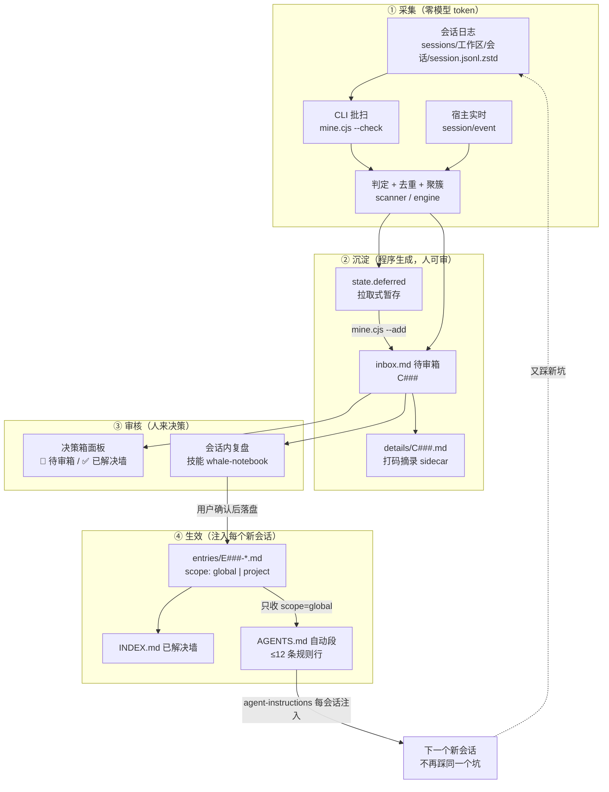
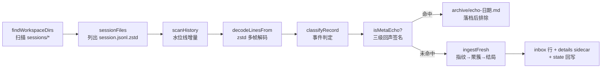

# 鲸鱼闪闪发光的小本本（whale-notebook）· 架构全景图

> 日期：2026-09-10 ｜ 版本：v0.7.2（源码内容已前移至 v0.7.3，见 §11.1）｜ 作者：DSH AI 会话 ｜ 类型：架构全景（现状快照）
> 定位：本文是**一张可通读的全景图**——把散落在 `plugin/README.md`、`PROJECT-INTRO.md`、`src/ui/contracts.md` 与 9 份设计文档里的架构事实收到一张图上，并补上**实测的现状**（§9）与**缺口清单**（§11）。
> 不替代既有文档：版本沿革看 `CHANGELOG.md`，设计论证看 `docs/` 九份设计记录，操作流程看技能 `whale-notebook`。

---

## 0. 怎么用这张图（3 分钟路线）

| 你想知道 | 直接跳 |
|---|---|
| 这东西到底怎么跑起来的（闭环） | §2 全景总图 |
| 「插件」在 DSH 里挂在哪一层 | §3 三平面：现在真正落地了什么 |
| 源码分成哪几块、谁能依赖谁 | §4 六模块分层 |
| 我的会话日志是怎么变成候选的 | §5 采集流水线 |
| GUI 右缘那个鲸鱼面板怎么接的 | §6 双半桥接 |
| 装/卸/升级动的是哪些文件 | §7 生命周期与部署 |
| 能不能手改数据文件 | §8 数据契约与不变式 |
| 现在到底什么状态 | §9 现状实况（实测） |
| 有什么坑还没填 | §11 缺口与风险 |

---

## 1. 一句话定位与四个支柱

**一句话**：把本机 DSH 全部工作区会话里反复出现的问题，自动挖掘 → 提炼为候选 → **经用户逐条确认**写成经验条目 → 以规则行注入 `~/.dsh/AGENTS.md` 自动段 → 每个新会话开始就被注入，从而"**从这次踩坑到永不重犯**"。

| 支柱 | 落地形态 |
|---|---|
| 数据源 | 只读本机会话日志 `~/.dsh/sessions/*/*/session.jsonl.zstd`（多帧 zstd + JSONL） |
| 沉淀形态 | `inbox.md` 待审候选 → `entries/E###-*.md` 条目 → AGENTS 自动段规则行 |
| 人机关系 | **先展示后写入**：候选/规则/条目一律先给用户看，确认才落盘；AI 从不静默改记忆 |
| 隐私 | 只读日志、不复制原文、入箱前打码（密钥 → `[REDACTED]`）、指纹只存 FNV-1a 短哈希、数据永不离开本机 |

---

## 2. 全景总图（闭环）



> 读图要点：**采集是程序（0 token）、审核是人、生效是注入**。三条入口（CLI 批扫 / 宿主实时 / 面板 ⟳）汇入**同一套判定与入库路径**，规则不会漂移。

---

## 3. 三层记忆与三平面：现在真正落地了什么

### 3.1 三层记忆（数据的三个高度）

| 层 | 位置 | 内容 | 谁维护 |
|---|---|---|---|
| **L1 全局记忆** | `~/.dsh/AGENTS.md` 自动段 | ≤12 条高频**全局**规则行 + 固定尾注 | 生成器 `src/inject/agents.cjs`，落盘由 agent 用 `edit` 工具 |
| **L2 技能（操作手册）** | `~/.dsh/skills/whale-notebook.md` | 复盘/审核/入库/讨论/忘掉/统计/体检 的流程 | 技能体系热加载，由生命周期安装器管理 |
| **数据** | `~/.dsh/whale-notebook/` | 待审箱、条目、已解决墙、归档、状态、设置 | `src/store/repo.cjs`（唯一读写入口） |

### 3.2 三平面（DSH 扩展体系里的落位）

```text
┌──────────────────────────── DSH 运行时 ────────────────────────────┐
│                                                                    │
│  【主机平面 / host composition】        ← 现在：已真实挂载           │
│   profiles/web/cordis.patch.yml 标记区内一行 insert：                │
│     - id: whale-notebook                                           │
│       name: '@deepseek-ai/dsh-whale-notebook'                       │
│       inject: [webServer]        ← 等 webServer 服务出现再挂载        │
│   提供：/whale/* HTTP 端点 + 订阅 session/event 常驻实时采集          │
│                                                                    │
│  【会话平面 / agent preset】          ← 现在：走官方注入机制，非插件行 │
│   AGENTS.md 自动段（agent-instructions 每会话注入）                   │
│   + 技能 whale-notebook                                             │
│   （设计文档预留的 preset 工具行 / 硬拦守卫 尚未启用）                 │
│                                                                    │
│  【UI 平面 / client bundle】          ← 现在：已真实挂载              │
│   package.json dsh.client = { platform: 'web',                      │
│     inject: ['@deepseek-ai/dsh-client-runtime'] }                   │
│   exports["./client"] → lib/client.js                               │
│   DSH client-loader 每请求现读磁盘 → 面板悬浮件（纯 DOM 注入）        │
└────────────────────────────────────────────────────────────────────┘
```

**关键认识**：「插件」在这里不是一个东西，而是**三处挂载点**——主机平面一行（端点 + 实时采集）、会话平面一段注入文本（规则行）、UI 平面一个 bundle（面板）。三者共享同一份 `src/` 逻辑与数据契约，可以各自独立演进。

**生效代价不同**（架构上很重要）：

| 改动什么 | 生效方式 |
|---|---|
| `lib/client.js`（面板） | **刷新页面**即可（loader 每请求现读磁盘 + no-cache） |
| `lib/index.js`、`src/**`（宿主半边） | **必须重启 `dsh web`**（会中断在线会话，时机由用户定） |
| `mine.cjs` 批扫 | 不依赖重启，立即可用 |

---

## 4. 六模块分层（`plugin/src/`，单向依赖）

```text
                    ┌──────────────────────────────────────────┐
   装配（无逻辑）    │  lib/index.js  ← apply(ctx)：注册端点/事件  │
                    └───────────────┬──────────────────────────┘
                                    │
      ┌──────────────┬──────────────┼───────────────┬──────────────┐
      ▼              ▼              ▼               ▼              ▼
 ┌─────────┐   ┌──────────┐   ┌───────────┐   ┌──────────┐   ┌──────────┐
 │  ui/    │   │ review/  │   │ collector/│   │ inject/  │   │ lifecycle│
 │ 展示层   │   │ 审核层    │   │ 记录层     │   │ 生效层    │   │ 自举安装  │
 │ viewmodel│  │ commit   │   │ decoder   │   │ agents   │   │ (仅 node │
 │ server   │   │ planCommit│  │ patterns  │   │ 自动段生成 │   │  内建)   │
 │ contracts│   │ (纯函数)  │   │ scanner   │   │          │   │ 与业务   │
 │ lib/client│  │          │   │ engine    │   │          │   │  解耦)   │
 │ .js      │   │          │   │ live      │   │          │   │          │
 └────┬─────┘   └────┬─────┘   │ cli       │   └────┬─────┘   └──────────┘
      │              │         └─────┬─────┘        │
      │              │               │              │
      ▼              ▼               ▼              ▼
 ┌───────────────────────────────────────────────────────────────┐
 │                      store/repo.cjs  数据层                    │
 │   路径常量 · 原子写 · settings/state/inbox/entries/details     │
 │   · INDEX 已解决墙生成器（唯一读写入口）                        │
 └───────────────────────────┬───────────────────────────────────┘
                             ▼
 ┌───────────────────────────────────────────────────────────────┐
 │                        core/  领域层（零依赖）                  │
 │  schema（类别/协议/模板） · privacy（打码/指纹，唯一出口）       │
 │  summarize（现象一句话） · similarity（骨架+3-gram 族判定）      │
 │  util                                                          │
 └───────────────────────────────────────────────────────────────┘
```

**依赖规则（禁止反向）**：`ui → viewmodel → store`；`review → (schema, inject, store)`；`inject → schema`；`collector → (core, store)`；`store → core`；`core` 零依赖。`lifecycle/` 与业务完全解耦，只依赖 node 内建。

| 层 | 一句话职责 | 关键导出 |
|---|---|---|
| `core/` | 全项目共用契约：类别表、打码、指纹、现象压缩、相似度 | `CATEGORY_TITLES`、`redact/hash36/canonText`、`oneLiner`、`similarity/bestFamily` |
| `store/` | 单一事实源：所有文件读写的唯一入口，原子替换 | `P`（路径常量）、`listEntries`、`readEntryText`、`buildIndexMd`、`writeDetail` |
| `collector/` | 会话日志 → 事件 → 候选；批扫与实时共用判定层 | `runScan`、`ingestFresh`、`createLiveCollector`、`classifyRecord` |
| `inject/` | 条目 → AGENTS 自动段正文（只收 `scope=global`） | `buildSectionBody`、`applyToText` |
| `review/` | 计划式入库纯函数：**只出计划，不写磁盘** | `planCommit`、`pickInboxRows` |
| `ui/` | 视图模型 + host 端点纯逻辑 + 面板 bundle | `listPayload`、`solvedPayload`、`relatedPayload`、`deleteCandidate` |

> **「纯函数出计划 + agent 工具落盘」是本项目反复出现的模式**：`review/commit.cjs` 与 `inject/agents.cjs` 都不写盘，由 agent 用 `write/edit` 执行——这样 `agent-instructions` 才能观测到 AGENTS.md 变更并**即时注入当前会话**。

---

## 5. 采集流水线（采集层）

### 5.1 端到端（函数级）



**水位线（增量）**：`state.files[日志绝对路径] = {size, mtimeMs, offset, frames, sid, ws, calls}`。

- 文件 `size+mtimeMs` 未变 → **只 stat 跳过**（热启动约 10ms、读 0 字节）；
- 变大 → 只解 `[offset, EOF)` 的新帧，**帧边界与行边界对齐**；末尾半写帧不推进 offset（下次自动重试）；
- 水位线失效（截断/轮转/非法帧头）→ 该文件退回全量重扫。

### 5.2 事件判定（什么算"坑"）

| 来源 | 判据 |
|---|---|
| 工具失败 | `tool/result` 的 `isError` → `cat='error'`（引擎内建类别） |
| 工具输出特征 | 命令类工具（`pwsh/bash/node`）成功输出命中特征词典（`patterns.cjs`） |
| 用户报障叙述 | `user/message` 命中 `NARRATION_IDS` + 强特征（限 12<n≤400 字，排除注入框架文本） |

**特征词典（10 类正则）**：`encoding`（编码乱码）、`sandbox-ep`（EPERM/ConstrainedLanguage/管道）、`sandbox-file`（沙箱拒绝写/审批）、`stale-fs`（read-before-edit）、`timeout`、`git-net`、`model-api`（限额/429）、`file-missing`、`port-busy`，加引擎内建 `error`。
`core/schema.cjs` 另备 16 个**条目展示类**标题（含 approval/tool-mode/secret/session-state/data-access/long-session/other）。
**只有 4 类接受用户叙述**（`NARRATION_IDS = encoding / sandbox-ep / sandbox-file / git-net`）——避免把用户的普通描述误判成坑。

**回声过滤（防止"小本本采集自己"）**：三级签名——`META_STRONG`、`META_DUMP` 单条即判；`META_WEAK` 需 ≥2 条。过滤对象是**自引用、探针输出、以及"把历史日志/sidecar/state 转储出来"的回显**（信封 `==== L### <kind>`、会话记录 JSON 信封、notebook 表行）。命中者**不静默丢弃**，落 `archive/echo-<日期>.md` 可事后审计。

### 5.3 去重、聚簇、同族、复发（状态机）

```text
                        ┌─────────────────────────────┐
   新事件 ──指纹重复？──▶│ 丢弃（seenFingerprints，上限 5000）│
      │否                                                 
      ▼
   聚簇哈希 cat|tool|canonText(text)
      │
      ├─ 命中在箱聚簇 ─────────▶ bump：只累加次数（不开新行）
      ├─ 命中已处置签名 ───────▶ resolved：压掉（归档表为事实源）
      │       └─ 但冷却期（7 天）内 ─▶ silent：静默计数
      ├─ 与某「族」相似 ───────▶ family：并入族代表行 + sidecar 记「同族并入」
      ├─ 曾处置且超冷却期 ─────▶ readd：复发重开，行前缀「复发（原 C0xx）：」
      └─ 都不是 ──────────────▶ new：新候选行（C###）
```

- **族（family）**：同一 `cid` 的多个聚簇天然构成一族；未命中同文聚簇但与族相似 → 并入族代表行（面板显示「**族×N**」），不新开行。
- **相似度算法**：`skeleton()` 剥掉易变部分（sid/uuid/IPv4/时间戳/带单位数值/路径/端口/长数字）→ 字符 **3-gram** 集合 → 得分 `max(Jaccard, containment×0.9)`；阈值**同类 0.6 / 跨类 0.8**（`settings.familyThresholdSame/Cross` 可调）；骨架短于 12 字符只认完全相等。
- **"同类"怎么算**：类别先归组（`CAT_ALIAS`：`git-net`/`timeout`/`model-api` → net，`sandbox-*` → sandbox，`error` 作通配兜底），同组才用宽松阈值。
- **设计意图**：把"还有没有类似问题"从**模型即兴归纳**变成**程序算得出、可复现、可解释**。程序只保证"该看哪些"，同根因与否由人/agent 给结论。

### 5.4 拉取式（当前模式）

`settings.autoAdd = false`（本机现状）时：

```text
扫描照常（增量、0 token） → 新发现只写 state.deferred（上限 200，按最近保留）
                          → 用户说「小本本复盘」→ mine.cjs --add 一次性冲入 inbox
已在箱候选命中共聚簇 → 仍然只累加次数（不受拉取式影响）
```

CLI 命令面（`scripts/mine.cjs` 是转发薄壳）：

| 命令 | 做什么 | 写盘 |
|---|---|---|
| `--check` | 增量扫描（默认模式） | state（+入箱时 inbox/details/echo） |
| `--add` | 不重扫，把 `deferred` 冲入待审箱 | inbox + details + state |
| `--check --add` | 扫完直接入箱（`--rebuild --add` 同） | 同上 |
| `--rebuild` | 清空水位线/聚簇/暂存/指纹，从头梳理全部历史 | state |
| `--full` | 忽略水位线全量重扫（仍按指纹去重） | state |
| `--dry` | 只看不写 | 否 |
| `--stats` | 统计（纯只读） | 否 |
| `--prewarm` | 只记指纹与水位线，不入箱 | state |
| `--render-rules` | 预览 AGENTS 自动段正文 | 否 |
| `--wall` | 预览已解决墙（INDEX.md）全文 | 否 |

---

## 6. 双半桥接：决策箱面板

### 6.1 通信拓扑

```text
        浏览器（GUI 页面）                         Node（dsh web 进程）
 ┌──────────────────────────────┐          ┌────────────────────────────────┐
 │ lib/client.js                │          │ lib/index.js  apply(ctx)        │
 │  __ModuleLoader__ bundle     │          │  ① 订阅 session/event → live     │
 │  exports.apply(ctx)          │  HTTP    │  ② webServer.register(8 个端点)  │
 │  ├ 纯 DOM 注入 body/head     │ ───────▶ │     业务纯逻辑在 src/ui/server.cjs│
 │  ├ 30s 轮询 + focus/可见性   │ ◀─────── │                                │
 │  ├ ctx.sessions/workspaces   │  JSON    │ 数据读写全部经 src/store/repo.cjs│
 │  └ ctx.effect(可逆清理)      │          │                                │
 └──────────────────────────────┘          └────────────────────────────────┘
```

- **不是 Slot 注册**：面板是"外挂式"——把 `<style>` 插进 `document.head`、面板节点插进 `document.body`，靠 `position:fixed; z-index:2147482000` 悬浮在 GUI 右缘；样式用 `var(--dsw-alias-*)` 主题 token 并带回落色值。
- **可逆**：`ctx.effect` 注册的清理函数在卸载时 `clearInterval`、摘掉 4 个全局监听、移除面板/toast/警示条节点。
- **面板不写记忆（契约红线）**：8 个端点里只有 2 个是写操作（删除候选 → 归档、触发增量扫描），**没有任何"审核/入库/忘掉"端点**——那些必须回落成"带编号回写会话 → 展示 → 用户确认 → agent 用工具落盘"，面板无权直接改 `entries/` 与 `AGENTS.md`。💬 讨论走的是客户端 `sessions`/`workspaces` 服务（非 HTTP）：`sessions.create({workspaceId})` → 等绑定 → 投递开局消息 → `sessions.open(id)`。
- **宿主侧的依赖姿态是"软依赖 + 优雅降级"**：加载器行声明了 `inject: [webServer]`（等 `webServer` 服务出现再挂载），而 `lib/index.js` 内部仍用 `ctx.get('webServer')` 取服务，取不到就 warn 并 return——**实时采集照常工作，只是面板 API 不注册**，不会因为缺一个服务把整个插件挂死。
- **轮询**：30s 一次（`document.hidden` 时跳过）+ `focus` / `visibilitychange` 立即刷新；风险观察另有一个独立 interval（`[WHALE-RISK]` 检测）。

### 6.2 端点契约（host half，共 8 个）

| 方法 | 路径 | 返回/入参要点 |
|---|---|---|
| GET | `/whale/inbox` | `{pending, rows[{id,cat,n,ws,text,time,variants}], deferred}` — `variants` = 族×N |
| GET | `/whale/inbox/detail?id=C###` | 候选详情 sidecar 文本（`details/C###.md`） |
| GET | `/whale/solved` | 已解决墙：`{stats{active,global,project,disabled}, global[{cat,title,entries[]}], projects[{ws,entries[]}], disabled[]}` |
| GET | `/whale/entry?id=E###` | 条目全文（frontmatter + 正文） |
| GET | `/whale/live` | 运行状态：`{version, live{...}, watermarks, clusters, fingerprints, lastScan}` |
| GET | `/whale/related?id=C###` | 讨论的**确定性依据**三块：`family`（族成员）+ `related`（相似候选，阈值 0.35）+ `entries`（可能已被条目覆盖，阈值 0.25） |
| POST | `/whale/inbox/delete` | body `{id:"C###"}` → 移入 `archive/`（**可恢复**，detail 随行归档）；带重入语义幂等 |
| POST | `/whale/scan` | 面板 ⟳：先 `live.flush()` 落盘缓冲，再 `runScan('--check')`；扫描中再次请求返回 **409** |

### 6.3 面板交互面

| 元素 | 行为 |
|---|---|
| 🐳 待审箱卡 | 候选行（现象 = 规则精炼一句话 ≤90 字）；行 hover 出动作；页头 ✅ 直达已解决墙 |
| ✅ 已解决墙卡 | 全局区（按类别分组）/ 项目区（按适用项目）/ 停用收尾；点行拉 `/whale/entry` 展开全文；页头 🐳 回待审箱 |
| ⟳ | 先触发增量扫描（零 token），再刷新；tooltip 报「新发现 N 条 / 无新发现 + 耗时」 |
| ✕（红色） | 删除候选 → 移入 `archive/`（可恢复） |
| 💬 详细讨论 | 取 `/whale/related` 三块证据 → **开新会话**并写入开局消息；落点由**讨论落点路由**决定（见 §11.1） |
| ⚡ 自动处理 | **已暂时隐藏**（`AUTO_VISIBLE=false`，代码与判定表保留）；恢复后仅允许"补全型小修"，禁区一律拒绝 |
| `[WHALE-RISK]` | agent 回复固定行 → 面板弹红色警示条 + 「转人工讨论」 |
| 页脚三态开关 | 「自动｜🐳 全局｜📁 项目」= 讨论落点手动覆盖，选择记 `localStorage` |
| 自隐逻辑 | 🐳 卡仅当 `pending>0 或 deferred>0` 才出；✅ 卡仅当 `active>0` 才出；两者皆无 → **整面板 `display:none`**（不打扰） |
| 反馈节奏 | toast 2800ms 淡出；`[WHALE-RISK]` 观察窗 = 每 4s 轮询会话快照、最多 45 次（≈180s），匹配行首 `[WHALE-RISK]` |

---

## 7. 生命周期与部署

### 7.1 三段足迹（"痕迹必须可指认"）

| 段 | 内容 | 归属 |
|---|---|---|
| **R 运行时** | `profiles/web/node_modules/@deepseek-ai/dsh-whale-notebook`（部署副本）+ `profiles/web/cordis.patch.yml` 标记区内的加载器行 | 生命周期只登记/对账/快照/驱动；**写入与删除一律交 `deploy-web.cjs`** |
| **I 集成** | `AGENTS.md` 标记区（+ `whole` 模式下整文件）+ 技能文件 | 生命周期安装器 |
| **D 数据** | `~/.dsh/whale-notebook/`（**用户记忆，永不静默删**） | 用户 |

**三个 zone（跨两个文件）**：

```text
~/.dsh/AGENTS.md
  <!-- whale-notebook:rules -->      … <!-- /whale-notebook:rules -->      ← 规则自动段
  <!-- whale-notebook:privacy -->    …（隐私尾注区）
~/.dsh/profiles/web/cordis.patch.yml
  # --- whale-notebook 决策箱面板 (deploy-web.cjs managed) ---
       - insert: [ { id: whale-notebook, name: …, inject: [webServer] } ]
  # --- /whale-notebook panel ---
```

生命周期清单（`.lifecycle/manifest.json`）只**按标记区**对账 R 段，**绝不整文件 hash 判漂移**（该文件可能同时含别的插件的行）。

### 7.2 命令面（两段式：干跑出计划 → 确认 → `--apply`）

| 命令 | 作用 |
|---|---|
| `lifecycle/cli.cjs status` | 阶段 / 各段足迹 / 上次操作（含 R 段现场对账） |
| `… check` | 清单 vs 现场对账 + 孤儿扫描（I/D 有问题 exit 1；**R 段是信息级**，不左右退出码） |
| `… install [--apply]` | 登记/安装（`--agents-mode whole\|zones`）；顺带完成清单版本迁移 |
| `… uninstall detach` | 仅摘 R 段（驱动 `deploy-web --undo`） |
| `… uninstall remove` | 清 R+I，**D 原样保留** |
| `… uninstall purge` | 全清：必须 `--export-dir` + `--yes`（先导出后删除） |
| `scripts/deploy-web.cjs [--apply\|--check\|--undo]` | **R 段唯一写入者**：物理复制包 + 在标记区内插/摘加载器行 |

**安全闸**：凡改写/删除外部目标先做**字节级前像快照** `.lifecycle/backups/<时间戳>/<id>.bak`（remove 后重装可**字节等价还原**）；登记后文件被外部改动 → remove 中止并提示 `--yes`（漂移守卫）；`purge` 前置导出 + 二次确认。

> **注意**：`deploy-web.cjs` **不往 DSH 产物里注入 JS**。浏览器半边靠 `package.json` 的 `exports["./client"]` + `dsh.client.platform="web"` 由 DSH 自身 client-loader 收录；本工具只做"复制包 + 插一行加载器"。

### 7.3 维护工具

`scripts/links-doctor.cjs`：体检/清理**工具主目录里的悬空 junction/symlink（死链）**。判据必须"跟随式"——`lstat` 看是不是链接、`statSync` 看目标在不在（`Test-Path` 对悬空 junction 会误报存在）。默认**只读**（**exit 3 = 发现悬空**）；`--apply` 逐条复验后**只摘链接本身**（实体目录/有效链接/根外路径一律不碰）。动机：死链会让 ripgrep 报 exit 2、**整次检索结果被丢弃**（条目 E005）。

---

## 8. 数据契约与不变式（改数据前必读）

| 对象 | 形态 |
|---|---|
| 待审行 | `\| C### \| 类别 \| 次数 \| 工作区 \| 现象(打码,≤120字) \| 首次出现 \|`（列内 `\|` 必须转全角 `｜`，否则该行无法被表格解析） |
| 候选详情 | `details/C###.md`：一句话 / 类别次数 / 源会话引用 ≤3 / **打码摘录 ≤600 字**；候选行移出时随行归档到 `archive/details/` |
| 条目 | `entries/E###-slug.md`：frontmatter（`id/title/category/status/scope/projects/occurrences/firstSeen/lastSeen/workspaces/rule/created/updated/sources`）+ `## 现象 / ## 根因 / ## 对策 / ## 验证` |
| 规则行 | `- 【类别】对策一句话`，进 AGENTS 自动段按 `occurrences` 降序取前 `maxRulesInAgents`(12) 条 |
| AGENTS 自动段 | 整段由生成器维护（**勿手改**），含状态行 + 规则行 + 3 行固定尾注（采集提醒/触发词/隐私） |
| 已解决墙 | `INDEX.md` = 全局区（`scope=global` 按类别）+ 项目区（`scope=project` 按项目）+ 停用收尾；生成器 `repo.buildIndexMd`，与面板 ✅ 卡**同源** |

**`state.json` 结构**（派生状态，可重建）：

```text
{ v:2, lastScan, nextCandidateId,
  seenFingerprints[],                 // 事件级指纹（FNV-1a 短哈希），上限 5000
  files{ <日志路径>: {size,mtimeMs,offset,frames,sid,ws,calls} },   // 水位线
  clusters{ <簇哈希>: {cid,cat,text,n,first,last,reAddedAt,reAdds,family,…} },
  deferred{ <簇哈希>: {cat,text,n,first,last,ws[],refs[],excerpt,at} } }
```

> **去重的事实源不是 `state.json` 而是归档表**（`archive/archive-*.md`，末列非空 = 已处置）。state 可被 `--rebuild` 清空，故"是否已处置"必须问归档——这条修掉了"重置/重扫后同一个坑重复开行"。

**`settings.json` 开关**：`autoCollect` / `autoAdd`（拉取式） / `liveCapture`（实时采集） / `scanMode` / `denylistWorkspaces` / `minOccurrences` / `maxRulesInAgents` / `reminderListMax` / `maxDeferred` / `maxFingerprints` / `reAddCooldownDays` / `familyThresholdSame|Cross`。

**隐私出口唯一**：`core/privacy.cjs` 的 `redact`（压白，指纹不变式依赖）/ `redactLines`（保留行结构）/ `hash36` / `canonText`。打码发生在**事件聚合之前**，所以 inbox / details / echo / 面板消费的全是已打码文本。

---

## 9. 现状实况（2026-09-10 16:4x 实测）

### 9.1 挂载与运行

| 项 | 实测值 |
|---|---|
| 插件包版本 | `package.json` = **0.7.2**（但源码内容已含 v0.7.3，见 §11.1） |
| 主机平面 | 已挂载：`profiles/web/cordis.patch.yml` 内 `insert: whale-notebook (inject: [webServer])` |
| 运行进程自报 | `GET /whale/live` → `version: 0.7.2`，`live.enabled: true` |
| 实时采集计数 | sessions 9 · events 17 · flushes 16 · added 0 · bumped 1 · **echoGroups 5**（回声过滤生效）· deferredGroups 11 · lastError null |
| 状态规模 | `watermarks` 26 份会话日志 · `clusters` 58 |
| 端点可用性 | `/whale/inbox` `/whale/solved` `/whale/related` `/whale/live` 均 **200**（宿主半边为 v0.7.x 代码） |

### 9.2 数据面

| 项 | 实测值 |
|---|---|
| 待审箱 | **2 条**：C128（git-net）、C129（error，`复发（原 C098）：`） |
| 已解决墙 | active **5**（全局 4 + 项目级 1），停用 0 |
| 暂存（未入箱） | `mine.cjs --check` → 新发现 0 组；**暂存共 9 组**；解码 5/26 文件、读 1.60MB、**170ms** |
| 生命周期清单 | `state=installed`、`phase=verified`；足迹 5 条（I×2、D×1、R×2） |
| 漂移提示 | `AGENTS.md` 与 skill 的登记 hash ≠ 现场 hash（**属预期**：自动段每次入库都被重写） |
| 部署对账 | `deploy-web --check` → **exit 1**：副本陈旧 3 个文件（缺 `scripts/links-doctor.cjs`、`links-doctor.selftest.cjs`，`README.md` 内容不同）；**`lib/*` 与权威源一致**，故面板功能不受影响 |
| 测试 | 9 套件 312 断言 + `bundle-smoke` + `redact.test`(13) + `links-doctor.selftest`(43) + `discuss-route.selftest`（v0.7.3） |

> **待办提醒**：`deploy-web --apply` 可清掉副本陈旧项（不改行为，只补 README 与维护脚本）；宿主半边 v0.7.2/0.7.3 若需生效，**重启 `dsh web`** 由用户择时。

---

## 10. 关键设计裁定（为什么长这样）

| 裁定 | 理由 |
|---|---|
| **程序出计划、agent 工具落盘** | 只有经 `edit` 工具改 AGENTS.md，`agent-instructions` 才能观测到变更并**即时注入当前会话**；生成器一律不写盘 |
| **唯一读写入口 `store/repo.cjs`** | 路径与行格式是不变式，未来换 sqlite/远程只改一层；禁止 UI 自行 `readFileSync` 后解析 |
| **批扫与实时共用判定层** | 三条入口共用 `classifyRecord` + `ingestFresh`，避免"实时"和"批扫"两套规则漂移 |
| **已处置以归档表为事实源** | `state.json` 是可重建的派生状态，用它判"已处置"会在重置/重扫后重复开行（实修过） |
| **同族由程序合并** | "还有没有类似问题"必须是可复现、可解释的程序结论，而不是模型即兴归纳 |
| **B1：项目级条目永不进全局自动段** | 跨项目会话里项目级规则是噪音；只在已解决墙"项目区"按项目查阅 |
| **拉取式（`autoAdd=false`）** | 扫描不花 token 且不打扰；何时把暂存冲进待审箱由用户决定 |
| **回声过滤"宁漏勿误伤"并落档** | 自引用会污染记忆；但误伤真坑的代价更大，故被滤者落 `archive/echo-*.md` 可审计 |
| **R 段唯一写入者** | 生命周期工具只登记/对账/驱动，写入集中在一处才能幂等、可撤销、可对账 |
| **两段式 + 前像快照 + 漂移守卫** | 改的是运行中的 GUI 与用户记忆，必须"先看计划、可回滚、外部改过要显式确认" |

---

## 11. 缺口与风险（按重要性）

> **修复进度**：本节的 A/B 两批（CLI 退出码、样式节点回收、版本口径、部署对账、`error` 类别契约）已实施并验证，执行记录见 `docs/2026_09_10_17_whale-notebookAB批次修复开发实施计划.md` §9；下文仍按 2026-09-10 16 时快照记述。

### 11.1 版本号漂移（建议优先修）

源码内容已前移到 **v0.7.3**——`scripts/discuss-route.selftest.cjs`、`bundle-smoke.cjs`（断言 v0.7.3 结构）、`src/ui/server.cjs`（v0.7.3 归档列修复）都已按 0.7.3 写，且 `lib/client.js` 已实现**讨论落点路由**（跨项目候选 → 开在固定的「鲸鱼全局」工作区；单项目 → 开在该项目工作区；未知/歧义 → 回退当前工作区并在 toast 说明；页脚三态开关 + `localStorage` 记忆；落点与依据写进新会话开局消息）。
**但** `package.json`、`lib/index.js` 的 `PACKAGE.version`、`README`/`PROJECT-INTRO` 的当前版本行仍写 **0.7.2**。影响：`/whale/live` 自报版本、`deploy-web --check` 的版本感知、人读文档都会误判"当前版本"。
> 连带提醒：`src/ui/contracts.md` §2 表格中「③ 桌宠 / ④ 外观」两行重复出现（文档小瑕疵）。

### 11.2 其余缺口

| # | 缺口 | 影响 | 备注 |
|---|---|---|---|
| 1 | **CLI 退出码恒 0** | `mine.cjs`/`collector/cli.cjs` 正常与失败都不设 `process.exitCode`，调用方只能解析 stdout 判定成败 | AGENTS 提醒句与技能都靠读输出文本；脚本化调用会有盲区 |
| 2 | **部署副本陈旧** | `--check` exit 1（README + links-doctor 缺失）；仅 `--apply` 可清 | `lib/*` 已一致，面板行为不受影响 |
| 3 | **宿主半边需重启** | 端点/实时采集的代码改动，不重启 `dsh web` 不生效 | 用户择时；面板改动刷新即可 |
| 4 | **水位线"同尺寸同 mtime 改写"会漏采** | 极端情况下（内容等长且 mtime 未变）不重扫该文件 | 理论缺口，实际概率低 |
| 5 | **`error` 类别无展示标题** | `CATEGORY_TITLES` 无 `error` 键，但实时采集大量产出 `cat='error'` | 面板/墙取名需兜底（当前显示原始键名） |
| 6 | **面板是 DOM 外挂而非 Slot 注册** | 依赖 GUI 的 `fixed/z-index` 可用性；契约文档里 U 平面的目标形态是 client-plugin Slot | 现形态简单可控，但属于"外挂"而非官方布局位 |
| 7 | **漂移守卫会为"预期改动"报警** | AGENTS.md/skill 每次入库都变，`check` 恒报漂移 | 语义上属正常，但削弱了"漂移 = 异常"的信号 |
| 8 | **`state.json` 明文存 `calls`（callId→工具名）与暂存 `excerpt`** | 已打码，但属运行细节 | 本机数据，风险低 |
| 9 | **面板 `<style>` 节点未纳入 disposer** | 面板卸载时样式节点残留（监听器、定时器、DOM 节点均已回收） | 单节点、幂等守卫，影响可忽略；但严格说不满足"每个副作用可逆" |
| 10 | **toast/警示条节点在"卸载后重挂载"时不重建** | 若面板被卸载过一次再挂载，toast/警示条可能不再出现 | 顶层变量判空导致；实际很少触发（通常只挂载一次） |

---

## 12. 扩展点地图（未来往哪长）

| 扩展点 | 现状 | 落点 |
|---|---|---|
| **会话平面工具/硬拦** | 仅"官方注入"（AGENTS + 技能） | agent preset 行（`config: { surface: 'tool' }`）+ 可能的 `tools/pre-execute` 守卫 seam |
| **B2 项目级自动注入** | 项目级条目只在墙里可查 | 各项目根 `AGENTS.md`（逐项目知情试点） |
| **跨平面事件通知** | 契约已定义、未实现 | `whale/inbox-changed` / `whale/entry-committed` / `whale/reminder`（`ui/contracts.md` §3） |
| **桌宠 / 独立对话窗** | 契约已备 | client overlay 或 ACP/sdk 外部进程桥，只消费视图模型 |
| **外观/主题** | 面板已用 `--dsw-alias-*` token | client-plugin 层，与数据层零耦合 |
| **复发检测深化** | 已有 `readd`/冷却/静默 | 二期 |
| **⚡ 自动处理恢复** | `AUTO_VISIBLE=false` 暂隐 | 置 `true` 即恢复；判定表硬规则仍在 |

---

## 13. 关键文件索引

| 文件 | 一句话职责 |
|---|---|
| `plugin/lib/index.js` | 宿主半边装配：订阅 `session/event` + 注册 8 个 `/whale/*` 端点 |
| `plugin/lib/client.js` | 浏览器半边：手写 `__ModuleLoader__` bundle，纯 DOM 悬浮双卡面板（1033 行） |
| `plugin/src/core/schema.cjs` | 领域契约：类别表 / scope / 设置默认 / AGENTS 标记 / 行与条目模板 |
| `plugin/src/core/privacy.cjs` | **隐私唯一出口**：打码 / 指纹 / 规范文本 |
| `plugin/src/core/similarity.cjs` | 骨架归一 + 3-gram 相似度 + 族判定（纯函数，可调阈值） |
| `plugin/src/store/repo.cjs` | 数据层唯一读写入口 + INDEX 已解决墙生成器 + 原子写 |
| `plugin/src/collector/decoder.cjs` | zstd 多帧 JSONL 解码 + 按帧边界增量读 |
| `plugin/src/collector/scanner.cjs` | 事件判定 + 三级回声签名 + 跨窗口 callId→工具名 |
| `plugin/src/collector/engine.cjs` | 水位线扫描 + 指纹/聚簇/族/复发 + 暂存 + 详情 sidecar（最大文件） |
| `plugin/src/collector/live.cjs` | 实时采集器：去抖 1.5s、串行写盘、异常全吞、遵守拉取式 |
| `plugin/src/collector/cli.cjs` | CLI 分发（10 个参数）；`scripts/mine.cjs` 为转发薄壳 |
| `plugin/src/inject/agents.cjs` | AGENTS 自动段正文生成器（只收 `scope=global`）+ 标记区整段替换 |
| `plugin/src/review/commit.cjs` | 计划式入库纯函数（`planCommit`），不写盘 |
| `plugin/src/ui/viewmodel.cjs` | 待审/统计/已解决墙视图模型（UI 唯一数据入口） |
| `plugin/src/ui/server.cjs` | 端点纯逻辑：list/detail/delete/solved/entry/related |
| `plugin/src/ui/contracts.md` | UI 与桌宠的接入契约、事件平面、复用契约 |
| `plugin/lifecycle/cli.cjs` | 生命周期工具（status/check/install/uninstall×3，仅 node 内建） |
| `plugin/lifecycle/zones.cjs` + `manifest.cjs` | 标记区几何运算 + 站点清单存取/快照/迁移 |
| `plugin/scripts/deploy-web.cjs` | **R 段唯一写入者**：复制包 + 插加载器行（幂等 + 字节对账） |
| `plugin/scripts/links-doctor.cjs` | 悬空链接体检/清理（默认只读，exit 3 = 发现悬空） |
| `PROJECT-INTRO.md` | 项目总览（路径地图 / 数据不变式 / 命令速查） |

---

## 14. 速查

```text
# 采集（零 token）
node ~/.dsh/whale-notebook/scripts/mine.cjs --check|--add|--stats|--full|--rebuild|--render-rules|--wall

# 面板 host 侧（运行中可直接探）
GET  http://127.0.0.1:3080/whale/inbox | /whale/solved | /whale/live | /whale/related?id=C###
POST http://127.0.0.1:3080/whale/scan   | /whale/inbox/delete {id}

# 部署（R 段唯一写入者；改后需重启 dsh web）
node ~/.dsh/whale-notebook/plugin/scripts/deploy-web.cjs [--apply|--check|--undo]

# 生命周期
node ~/.dsh/whale-notebook/plugin/lifecycle/cli.cjs status|check|install|uninstall detach|remove|purge

# 维护体检
node ~/.dsh/whale-notebook/plugin/scripts/links-doctor.cjs [--json|--apply]
```

---

> **一句话收束**：whale-notebook 是"**三处挂载点 + 六层模块 + 三条采集入口 + 一条注入链路**"构成的自我进化闭环——程序负责"看见并记住"，人负责"同意"，注入负责"下次别再犯"；全部数据在本机、全部写入经用户确认、全部副作用可回滚。
